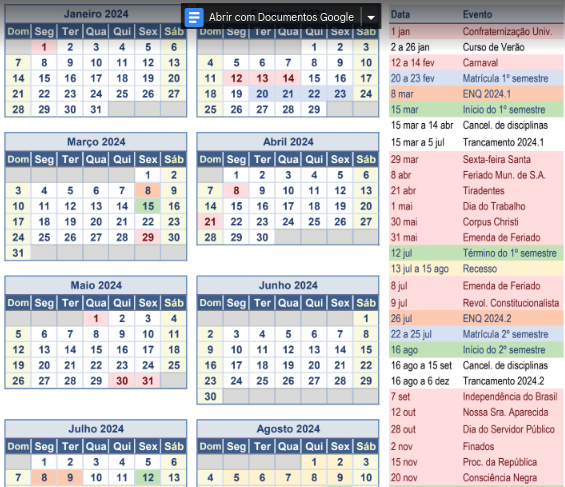

#        Fundamentos de Cálculo 2024 - 1

------

**Professor** Jair Donadelli   —   **email**  jair.donadelli 'arroba' ufabc.edu.br   —   **sala** 546-2 bloco A

---

**Ementa** Sequências de números reais. Limite de funções. Funções contínuas. Derivação. Integração.

**Horário** sextas as 13:00 na sala 308-3

**Referência Bibliográfica** 

1. GUIDORIZZI, H. L. Um curso de cálculo, vol. 1. Rio de Janeiro: LTC, 2021. [Nº de chamada na biblioteca 515 GUIDcu6]

2. STEWART, J. Cálculo, vol I, Editora Thomson 2009. [Nº de chamada na biblioteca 515 STEWca4]

3. MUNIZ NETO, A. C. Fundamentos de cálculo. SBM, 2015 (Coleção PROFMAT). 

**Material auxiliar**

**[Notas de aula](https://drive.google.com/file/d/1dndFykK8wBE6xB6pciJ6PI4M5TXcoJTf/view?usp=sharing)** 

[**Videoaulas**](https://profmat-sbm.org.br/ma-22/) de MA-22

[**Videoaulas**](https://www.youtube.com/c/funcoesdeumavariavelufabc) de Funções de uma variável - UFABC

## **Programação**

1. (15/03) Supremo e ínfimo. [Exercícios](lista1.pdf)
2. (22/03) Limites de sequências e propriedades. Complemento da aula (15min): [operações com limite](https://www.youtube.com/watch?v=90l2f7hSKc4). [Exercícios](lista2.pdf).

(29/03) Feriado.

3. (05/04) Limites de funções. Complemento da aula (15min):  [Teorema do confronto e Limites fundamentais](https://www.youtube.com/watch?v=uBTslDSsdQA). [Exercícios](lista3.pdf).
4. (12/04) Limites infinitos e no infinito. Função contínua. Complemento da aula (15min): [Regra da Cadeia e Continuidade Sequêncial](https://www.youtube.com/watch?v=j7YdpJoU7Lo). [Exercícios](lista4.pdf).
5. (19/04) Teoremas de Weierstrass, do valor intermediário e aplicações. Complemento da aula (17min): [estudo de continuidade da inversa de uma função](https://www.youtube.com/watch?v=9XD6VMDuS6o). [Exercícios](lista5.pdf).
6. (26/04) A função $f(x) = a^x$ ($a\in \mathbb R^*_+\setminus\{1\}$). O problema da tangente e Derivadas: definição e derivadas de algumas funções elementares ($x, x^2, \sqrt{x},\ln(x), \exp(x),\sin(x),\cos(x)$). Complemento da aula (10min): [Estudo da Derivada de $f^{-1}$​ e Derivadas de Ordem Superior](https://www.youtube.com/watch?v=6jrFs0x4TkA). [Exercícios](lista6.pdf).
7. (03/05) Regras operacionais de derivação: derivada de soma, produto e composição de funções. Derivada de função implícita. [Exercícios](lista7.pdf).

(10/05) Prova (conteúdo: limite)

8. (17/05) Taxas de variação e taxas relacionadas. Aproximação linear. Teoremas de Fermat,  de Rolle e do Valor Médio. Complemento da aula (7 min): [Teorema do Valor médio de Cauchy e Regra L'Hopital](https://youtu.be/xXwZtm1eSfE?si=jbT_7dwCMp2ymC7K&t=456)  [Exercícios](lista8.pdf).

9. (24/05)  Consequências e aplicações do TVM; crescimento de funções; concavidade e inflexão; máximos e mínimos. Complemento da aula (20min): [Esboço de gráfico](https://eaulas.usp.br/portal/skins/default/video?idItem=23838) [Exercícios](lista9.pdf)

(31/05)  Feriado

10.  (07/06)  O conceito e propriedades de integral definida. [Exercícios](lista10.pdf).

(14/06)  Prova (conteúdo: derivada)

11.  (21/06)  O teorema fundamental do cálculo. Algumas aplicações à geometria. Complemento: Integração (1) [por substituição](https://www.youtube.com/watch?v=bd1DR6q0SoQ&list=PLsY9T-5TmwNt3Zj_eafapZtQcTsfyPz6B&index=9), (2) [por partes](https://www.youtube.com/watch?v=cVxxbDxZpJw&list=PLsY9T-5TmwNt3Zj_eafapZtQcTsfyPz6B&index=9). [Exercícios](lista11.pdf).
12.  (28/06) Métodos de integração. [Exercícios](lista12.pdf).

(05/07) Prova (conteúdo: integral)

(12/07) Prova Recuperação (conteúdo: tudo)

#### Calendário

## **Avaliação**

O método avaliativo consistirá de **tarefas** (30%) e 3 **provas** (70%) presenciais.

As tarefas extra classe podem ser listas, exercícios semanais, testes no *moodle* e terão prazo de entrega.

##### Conceito final 

| Conceito | Intervalo       |
| -------- | --------------- |
| A        | $M\geq 8,5$     |
| B        | $7,0\leq M<8,5$ |
| C        | $4,5<  M < 7,0$ |
| F        | $M \leq 4,5$    |

------

*O que é permitido e o que não é permitido nas tarefas*
O que **pode**:
• Consultar colegas da disciplina.
• Consultar docente.
O que **não pode**:
• Divulgar sistematicamente as respostas dos exercícios por qualquer meio físico ou virtual.

O **Código de Ética da Universidade Federal do ABC** estabelece em seu Artigo 25 que: Quanto aos trabalhos acadêmicos, é eticamente inaceitável que os discentes:
**I** fraudem avaliações;
**II** fabriquem ou falsifiquem dados;
**III** plagiem ou não creditem devidamente autoria;
**IV** aceitem autoria de material acadêmico sem participação na produção;
**V** vendam ou cedam autoria de material acadêmico próprio a pessoas que não participaram
da produção.

------

