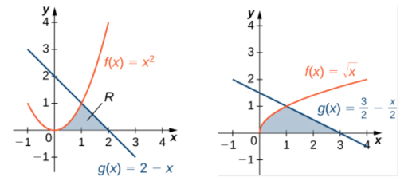
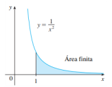
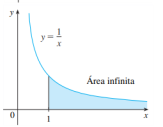
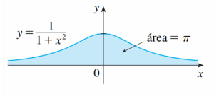

# Exercícios da aula 11

1. Calcule a área da região compreendida pelos eixos $Ox$, $Oy$, pela reta definida por $x = 1$ e pelo gráfico da função $f(x) = 1/(1 + x²)$​​.
   
2. Encontre a área da região entre as curvas R definida nas figuras abaixo

3.  Calcule a área da região delimitada pela curva $y = \frac 1x $, pelo eixo $Ox$ e as retas $y = x$ e $x = 4$.

4. Defina $\ln(x) =\int_1^x \frac 1t dt$, ou seja, a função logaritmo natural $\ln : (0,+\infty)\to\mathbb R$  fica definida como a primitiva da função $\frac 1x$,   para $x>0$, com a condição $\ln(1)=0$. 

   Use a regra da derivada de função inversa para calcular a derivada da função $\exp:\mathbb R \to \mathbb R$  dada por $\exp(x) =\mathrm{e}^x$, inversa de $\ln(x)$​.
   
5. Seja $f(x) = 1 + \int_0^{2x} \cos (t^2) dt$. Calcule a equação da reta tangente ao gráfico de $f^{ −1}$​​ no ponto de abscissa 0.
   
6. **Integral imprópria** Se $f$ é integrável em $[a,x]$ para todo $x\geq a$, a integral imprópria de $f$ no intervalo $[a,+\infty)$ é $\displaystyle {\int_a^{+\infty}f(x)\,\mathrm{d}x = \lim_{b\to     +\infty}\int_a^bf(x)\,\mathrm{d}x}$​ quando o limite existe.

   
   
   Por exemplo, 
   $\displaystyle {\int_1^{+\infty}\frac 1{x^2} \,\mathrm{d}x = 
     \lim_{b\to +\infty} \left( - \frac 1{x}\right) \Bigg\vert_1^b=
     \lim_{b\to +\infty} \left( 1 - \frac 1{b}\right) =   1}$ 

   Entretanto $ \displaystyle{\int_1^{+\infty}\frac 1{x} \,\mathrm{d}x = 
     \lim_{b\to +\infty} \ln (b) = +\infty.}$​                   

Prove que $\displaystyle{\int_{-\infty}^{+\infty} \frac1{1+x^2}\,\mathrm{d}x =\pi.}$          
