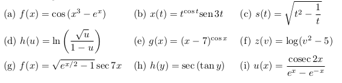
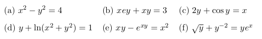

## Exercícios da aula 7 

1. Derive as funções

   

2. Seja $g : \mathbb R → \mathbb R$ uma função derivável tal que $g(2) = 2$ e $g'(2)=0$. Calcule $H'(2)$, sendo $H$
   dada por $H(x) = g(g(g(x)))$.

3. Encontre $dy/dx$ onde $y = f (x)$ é uma função diferenciável dada implicitamente pela equação:
   

4. Uma partícula está se movendo ao longo da curva $y =\sqrt x$. Quando a partícula passa pelo
   ponto $(4, 2)$, sua coordenada $x$ cresce a uma taxa de 3 cm/s. Quão rápido está variando a
   distância da partícula à origem nesse instante?

