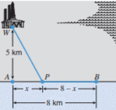

# Exercícios da aula 9

1. Seja $f(x) = x^4 + 2x^2 − 3x$, então $f'(x) = 4x^3 + 4x − 3$. Use o Teorema de Rolle para mostrar que a equação $4x^3 + 4x−3 = 0$ possui pelo menos uma solução no intervalo (0, 1).
2. Mostre que:

      - um polinômio de grau 2 tem, no máximo, 2 raízes reais;
      - um polinômio de grau 3 tem, no máximo, 3 raízes reais;
      -  um polinômio de grau n tem, no máximo, n raízes reais.
3. Verifique se cada uma das funções abaixo, definidas no intervalo $[a, b]$, satisfaz as hipóteses do Teorema do Valor Médio. Caso afirmativo, determine um número $c ∈ (a, b)$ tal que $f'(c) = (f(b) − f(a))/(b - a)$.

      - $f(x) = |x − 2|$, $[a, b] = [0, 4]$.
      - $f(x) = \begin{cases} (x−1)^{-1} &\text{ se } 0 ≤ x ≤ 2 \text{ e } x \neq 1 \\  0 &\text{ se } x = 1\end{cases}$  para $ [a, b] = [0, 2]$​.
4. Demonstre que $\text{e}^\pi >\pi^\text{e}$. (*Dica*: Use o TVM com $f(x)=\ln(x)/x$, $x\in [\text{e},\pi]$​).
5. Determine a função $f$ definida para todo $x > 0$ e tal que $f'(x)= x + \frac 1{\sqrt{x}}$ com  $f(1)=0$.
6. Determine o ponto da reta $y=\frac x3 +\frac 23$ que está mais próximo da origem.
7. Uma calha deve ser construída com uma folha de metal de largura 30 cm dobrando-se para cima 1/3  da folha de cada lado, fazendo-se um ângulo θ com a horizontal. Determine o ângulo que vai maximi-zar a quantidade de água que a calha pode conter. (Modele o problema e depois resolva-o. Não  basta calcular o   máximo e o mínimo: deve-se justificar os cálculos; em todos os problemas de otimização.).
8. Determine a área do maior retângulo com lados paralelos aos eixos $x$ e $y$ que pode ser inscrito na elipse $\mathcal E$ dada por $\left(\frac xa\right)^2 + \left(\frac yb \right)^2 = 1$ ($a, b > 0$).
9. A Figura mostra um poço de petróleo no mar em um ponto W a 5 km do ponto A mais próximo de uma    praia reta. O petróleo é bombeado de W até um ponto B na praia a 8 km de A da seguinte forma: de W   até um ponto P na praia entre A e B através de uma tubulação colocada sob a água, e de P até B através de uma tubulação colocada ao longo da praia. Se o custo para colocar a tubulação for de \$1.000.000/km sob a água e de $500.000/km por terra, onde deve estar localizado P para minimizar o custo de colocar a tubulação? 

10. Se você encaixar o maior cone  circular reto possível dentro de uma esfera, que fração do volume da esfera será ocupada pelo cone? 
