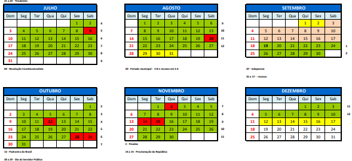

# MA 41 - Probabilidade e Estatística (2022-2)
[toc]

Nesta disciplina Introduzimos os conceitos essenciais da teoria de probabilidade e suas implicações e aplicações na
estatística. 

Esta disciplina está no moodle: https://moodle.ufabc.edu.br/course/view.php?id=3667

Aulas: 6ª 14h00 - 17h00 na S-311-1	

## Ementa 

A Natureza da estatística. Tratamento da informação. Distribuições de frequência e gráficos. Medidas. Conceitos básicos em probabilidade. Probabilidade condicional e Independência. Variáveis aleatórias discretas e contínuas. Função de distribuição acumulada. Esperança e variância de variáveis aleatórias. Modelos Bernoulli, binomial e geométrico. Modelo uniforme e modelo normal. Distribuição assintótica da média amostral. Introdução à inferência estatística.

## Referência Bibliográfica

1. ROSS, SHELDON. Probablidade. Editora Bookman, 
2. BUSSAB, MORETTIN, W. Estatística básica. Editora Saraiva, 2010.
3. PINHEIRO, R; CUNHA, G. Probabilidade e estatística: quantificando a incerteza. Editora Campus, 2012.

### Material Complementar

1. Notas introdutórias em
   Probabilidade e Estatı́stica [[Intro](https://www.ime.usp.br/~lrenato/intro.pdf), [Cap1](https://www.ime.usp.br/~lrenato/cap1.pdf), [Cap2](https://www.ime.usp.br/~lrenato/cap2.pdf), [Cap3](https://www.ime.usp.br/~lrenato/cap2.pdf), [Cap4](https://www.ime.usp.br/~lrenato/cap2.pdf), [ApA](https://www.ime.usp.br/~lrenato/app.pdf), [ApB](https://www.ime.usp.br/~lrenato/appa.pdf)], Luiz Renato Gonçalves Fontes. IME/USP.
2. [Introdução à Probabilidade só com moedinhas](https://docs.google.com/file/d/0B9XKocDKyVcPZ2NJZHYwTmplMVE/edit?resourcekey=0-ZdYlaPzt77ZVlHn7vF2FIQ), T. Franco, M. Hilario & P. Silva. 2º Colóquio de Matemática da Região Nordeste, SBM.
3. [Probabilidade](https://jutria.github.io/prob/), Jaime Utria
4. [Estatística para Estudantes de Matemática](Estatistica.pdf), Mônica C. Sandoval, Silvia L. P. Ferrari e Heleno Bolfarine. III Colóquio de Matemática da Região Sul, 2014.
5. [Introdução à Probabilidade e à Estatística](https://anotacoesdeaula.wordpress.com/category/ipe/), J.D. Notas de aula.
6. [Probabilidade discreta](https://moodle.ufabc.edu.br/pluginfile.php/371906/course/section/31985/1.pdf?time=1644847083480) e [Variáveis aleatórias discretas](https://moodle.ufabc.edu.br/pluginfile.php/371906/course/section/31985/3-variaveis.pdf), notas de aula,  JD (arquivos no moodle). 
7. [Statistics 110: Probability](https://projects.iq.harvard.edu/stat110), Joe Blitzstein, Professor of the Practice in Statistics
   Harvard University, Department of Statistics.
8. www.randomservices.org/random. Random services, um site com material (texto, simuladores e dados) de Probabilidade, Estatística Matemática e Processos Estocásticos.
9. [Introduction to Probability, Statistics, and Random Processes](https://www.probabilitycourse.com/), by Hossein Pishro-Nik. Site do livro Introdução à Probabilidade, Estatística e Processos Aleatórios com um livro-texto aberto, vídeos, calculadoras de probabilidade online para funções e distribuições importantes, slides de aula.

## Critérios de Avaliação

A composição do conceito final será obtida da seguinte forma: 

- Atividades Semanais e Individuais, Moodle: **20%**.
- Prova (30% - semana 5) + Prova (30% - semana 10) + Prova Final (40% - semana 16): **80%**. 

#### Conversão Nota para Conceito

- R: se Nota < 5
- C: se Nota < 7
- B: se Nota < 9
- A: nos outros casos.

## Aulas semanais às 6as conforme calendário

| Semana | Tema | Tópicos                                                      |      |      |
| ------ | ---- | ------------------------------------------------------------ | ---- | ---- |
| **01** | Prob | Probabilidade e Propriedades de uma probabilidade            |      |      |
| **02** | Prob | probabilidade condicional                                    |      |      |
| **03** | Prob | Teoremas da Probabilidade Total e de Bayes                   |      |      |
| **04** | Prob | Variáveis aleatórias discretas, algumas distribuições importantes, média variância. |      |      |
| **05** | Prob | Variáveis aleatórias contínuas, exemplos de fda e fdp, distribuição uniforme, média variância. |      |      |
| **06** | Prob | Distribuição normal e Teorema Central do Limite              |      |      |
| **07** |      | aula de dúvidas e **Avaliação** (*online*)                   |      |      |
| **08** | Est  | Estatística descritiva. Gráficos, medidas de posição e dispersão. |      |      |
| **09** | Est  | Estatística descritiva. Análise bivariada.                   |      |      |
| **10** |      | aula de exercícios                                           |      |      |
| **11** | Est  | **Avaliação** 2                                              |      |      |
| **12** | Est  | Feriado                                                      |      |      |
| **13** | Est  | Amostragem, distribuição amostrais de média e proporção.     |      |      |
| **14** | Est  | Estimação.                                                   |      |      |
| **15** | Est  | Teste de hipóteses                                           |      |      |
|        | Est  | **Avaliação** 3                                              |      |      |

