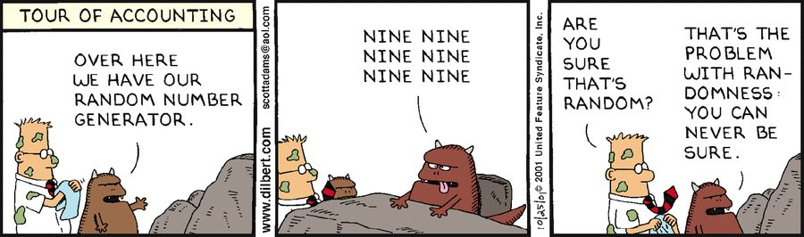
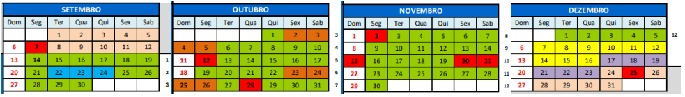
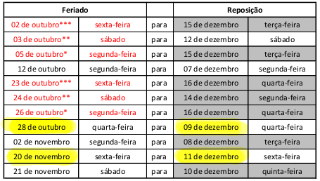
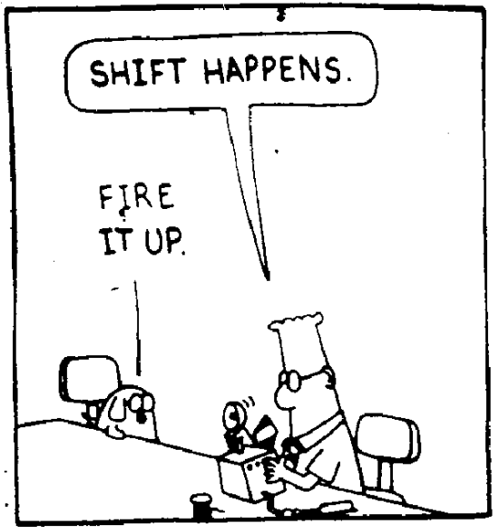
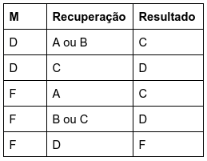

MCZA035-17 Algoritmos Probabilísticos 
2026-3

    <a href="http://hostel.ufabc.edu.br/~jair.donadelli">Jair Donadelli</a> --- jair.donadelli&#64;ufabc.edu.br --- Sala 546 torre 2 bloco A 
    4ª 8h00 sala S-206-0   e   6ª 10h00 sala S-206-0  

 

------
A aleatoriedade consolidou-se como um dos paradigmas centrais no projeto de algoritmos eficientes. Em muitos problemas computacionais, algoritmos aleatorizados são mais simples, mais rápidos e utilizam menos memória do que suas contrapartes determinísticas. Em outros, especialmente em aplicações de larga escala, constituem a única abordagem computacionalmente viável. Atualmente, algoritmos aleatorizados estão presentes em inúmeras tecnologias utilizadas diariamente, desde mecanismos de busca na Web, bancos de dados e sistemas distribuídos até criptografia, inteligência artificial, aprendizado de máquina e processamento de grandes volumes de dados. Ao longo do curso, serão estudados tanto os fundamentos teóricos quanto aplicações em problemas práticos, evidenciando como a aleatoriedade pode ser utilizada para obter soluções eficientes e confiáveis.

------

**E-mails:** Toda comunicação ‘aluno → professor’ por email deve ser com o endereço oficial.

Os comunicados gerais ‘professor → aluno’ serão pelo sigaa.

------

## **Objetivos**

Esta disciplina propõe uma mudança conceitual no raciocínio algorítmico, substituindo garantias determinísticas e absolutas por análises probabilísticas de desempenho e erro. O objetivo pedagógico central do curso não é a mera apresentação de um catálogo de algoritmos, mas o desenvolvimento de uma intuição probabilística: um arcabouço analítico que capacite o estudante a projetar e avaliar soluções sob condições de incerteza, aproximação e escala. A capacidade de identificar quando e como substituir a certeza absoluta por ganhos expressivos em tratabilidade computacional constitui uma das competências mais relevantes para a formação do profissional, preparando-o para enfrentar os desafios computacionais mais complexos da atualidade.

### Objetivos específicos

Esta disciplina tem como objetivo  apresentar os fundamentos dos algoritmos aleatorizados, capacitando o aluno a  compreender, analisar e projetar algoritmos que utilizam aleatoriedade como ferramenta para obter soluções eficientes para problemas computacionais. Ao final do curso, o aluno deverá ser capaz de:

- *Compreender*  o comportamento de processos e algoritmos aleatórios, o poder e as limitações da aleatoriedade no projeto de algoritmos. 
- *Analisar* algoritmos aleatorizados, dominando técnicas de análise probabilística baseadas em desigualdades de concentração; a maestria dessas técnicas é um resultado central do curso. 
- *Projetar e implementar* algoritmos aleatorizados para problemas em diversas áreas da ciência da computação, utilizando técnicas como  aleatorização, amostragem  e cadeias de Markov. 
- *Reconhecer* e justificar situações em que abordagens probabilísticas são superiores a abordagens determinísticas. 
- *Aplicar* técnicas probabilísticas a diversas áreas, como estruturas de dados, algoritmos em grafos, testes probabilísticos e problemas computacionais de grande escala.

## **Programação da disciplina**

### Ementa

Revisão de probabilidade discreta. Exemplos de algoritmos aleatorizados: Algoritmo para
Identidade polinomial; Sigilo perfeito; MAX 3-SAT. Leis de desvios e aplicações em algoritmos e
estruturas de dados: hashing universal; treaps. Modelos de computação e classes
probabilísticas de complexidade. Aplicações de Cadeias de Markov. Passeios aleatórios em
grafos. Algoritmos distribuídos probabilísticos.

### Calendário

#### Reposição de feriados

  

### Programação das Aulas
| Semana | Módulo temático                                              | Tópicos principais                                           | Referências                                                  | Leitura e exercícios                                         |
| ------ | ------------------------------------------------------------ | ------------------------------------------------------------ | ------------------------------------------------------------ | ------------------------------------------------------------ |
| **1**  | Fundamentos                                                  | Probabilidade discreta, RVs, esperança, linearidade, Monte Carlo/Las Vegas | Mitzenmacher & Upfal, Motwani & Raghavan, Cap. 1             | [Notas de aula](semana01.pdf) e [exercícios da semana](lista1.pdf) |
| **2**  | Análise probabilística de algoritmos (Congresso UFABC e UFABC para todos - aula suspensa) | Quicksort aleatorizado, esperança, variância, Markov, Chebyshev | Mitzenmacher & Upfal, Cap. 2,3. Motwani & Raghavan, Cap. 1,3 | [Notas de aula](semana02.pdf) e [exercícios](lista2.pdf).    |
| **3**  |                                                              | QS, Markov, Chebyshev (cont)  Dominância estocástica e acoplamento |                                                              | [slide](dominancia.pdf) [exercícios](lista3.pdf) [Notas de aula](semana03.pdf) |
| **4**  | Concentração e amplificação  Estruturas aleatorizadas     | Chernoff-Hoeffding, QS, Amplificação de probabilidade de sucesso, Skip list. | Motwani & Raghavan Cap. 4,8  Mitzenmacher & Upfal, Cap. 4 | Notas de aula – em breve – e [exercícios](lista4.pdf).       |
| **5**  | Hashing e estruturas aleatorizadas                           | Universal hashing, skip lists, Bloom filters e análise de falso positivo, Cuckoo hashing | Motwani & Raghavan, Cap. 8; Mitzenmacher & Upfal             | Notas de aula e exercícios.                                  |
| **6**  |                                                              | Universal hashing,Bloom filters e análise de falso positivo, Cuckoo hashing |                                                              | Notas de aula e exercícios.                                  |
| **7**  | Algoritmos aleatorizados em grafos                           | Karger; análise de probabilidade de sucesso e amplificação   | Motwani & Raghavan, Cap. 7                                   | Notas de aula e exercícios.                                  |
| **8**  | Passeios aleatórios e Markov                                 | Random walks, Markov chains, hitting/cover time, distribuição estacionária | Motwani & Raghavan; Levin, Peres & Wilmer                    | Notas de aula e exercícios.                                  |
| **9**  | Mixing e Monte Carlo                                         | Coupling, mixing times, MCMC; Metropolis–Hastings como exemplo | Levin, Peres & Wilmer; Mitzenmacher & Upfal                  | Notas de aula e exercícios.                                  |
| **10** | Redução de dimensionalidade **ou** Algoritmos aleatorizados para grandes volumes de dados **ou** Complexidade computacional | Projeções aleatórias, Lema de Johnson–Lindenstrauss   **ou**   streaming, sketches, estimação de frequência, elementos distintos  **ou**  classes de complexidade, P, NP,RP, ZPP, BPP. | Vershynin, Arora & Barak; Dubahshi & Panconesi; Motwani & Raghavan; Mitzenmacher & Upfal | Notas de aula e exercícios.                                  |
| **11** | Redução de dimensionalidade **ou** Algoritmos aleatorizados para grandes volumes de dados **ou **Criptografia | Locality Sensitive Hashing e approximate nearest neighbors   **ou**   streaming, heavy hitters, estimação de frequência, elementos distintos  **ou**   funções one-way; geradores pseudoaleatórios seguros;criptografia de chave pública. Provas com conhecimento zero. | Vershynin, Arora & Barak; Dubahshi & Panconesi; Motwani & Raghavan; Mitzenmacher & Upfal | Notas de aula e exercícios.                                  |
| **12** | **Prova** e **Sub**                                          | —                                                            | —                                                            | —                                                            |
| **13** | **Avaliação recuperativa** em **11/12**                      | Todo conteúdo                                                | —                                                            | —                                                            |

[NOTAS DE AULA](algale.pdf) (contruída no decorrer da disciplina)

### Bibliografia

1. DUBHASHI, Devdatt; PANCONESI, Alessandro. *Concentration of measure for the analysis of randomized algorithms*. Cambridge: Cambridge University Press, 2009.

2. MITZENMACHER, Michael; UPFAL, Eli. *Probability and computing: randomized algorithms and probabilistic analysis*. Cambridge: Cambridge University Press, 2005.

3. MOTWANI, Rajeev; RAGHAVAN, Prabhakar. *Randomized algorithms*. Cambridge: Cambridge University Press, 1995.

#### Bibliografia complementar

4. HROMKOVIČ, Juraj. *Design and analysis of randomized algorithms: introduction to design paradigms*. Berlin: Springer, 2005. (*[online](https://link.springer.com/book/10.1007/3-540-27903-2)*)
5. ARORA, Sanjeev; BARAK, Boaz. *Computational complexity: a modern approach*. Cambridge: Cambridge University Press, 2009.
6. BLUM, Avrim; HOPCROFT, John; KANNAN, Ravindran. *Foundations of data science*. Cambridge: Cambridge University Press, 2020. ([*online*](https://www.cs.cornell.edu/jeh/book.pdf))
7. VERSHYNIN, Roman. High-dimensional probability: an introduction with applications in data science. Cambridge: Cambridge University Press, 2018. (online, soluções)
8. HÄGGSTRÖM, Olle. *Finite Markov chains and algorithmic applications*. Cambridge: Cambridge University Press, 2002.

------

### Atendimento

Quartas das 10h às 12h ou em horário previamente combinado, pessoalmente ou por email.

------

## **Avaliação**

 **Provas**.  30/10 e 27/11  

As avaliações são individuais, presenciais e sem consulta. Avalia-se a capacidade do aluno de analisar algoritmos probabilísticos de forma rigorosa, com ênfase em demonstrações, garantias probabilísticas e raciocínio matemático estruturado. Critérios e Pesos:

| Critério                                    | Peso |
| ------------------------------------------- | ---- |
| Correção matemática                         | 40%  |
| Rigor e completude das provas               | 30%  |
| Uso adequado de ferramentas probabilísticas | 20%  |
| Clareza, organização e notação              | 10%  |

**Expectativas formais** : – Escrita matemática clara, precisa e bem organizada. – Uso consistente de notação. – Argumentos probabilísticos explícitos e justificados. – Definição clara de eventos, variáveis aleatórias e espaços de probabilidade.

**Observações específicas**: - Resultados conhecidos podem ser utilizados apenas se explicitamente citados. - Demonstrações parciais corretamente estruturadas podem receber crédito proporcional. - Respostas corretas sem justificativa não recebem pontuação.

#### Conceito final

- Conceito A: média final ≥ 90  
- Conceito B: 75 ≤ média final < 90  
- Conceito C: 52 ≤ média final < 75  
- Conceito D: 50 < média final < 52  
- Conceito F: média final ≤ 50  

### Instruções para as provas

 1. *Podem* utilizar lápis, desde que a escrita seja legível, ou caneta, exceto na cor vermelha.

   2. *Podem* responder às questões em qualquer ordem.

   3. *Podem* usar parte da folha de resposta como rascunho, identificando-a no topo da página com a palavra Rascunho.

   4. *Podem* entregar a prova a qualquer momento, desde que assinem a lista de presença.

   5. *Devem* trazer um documento com foto atual.

   6. *Devem* deixar as mochilas no chão, com o celular dentro (desligado ou silenciado). É **proibido** o uso de eletrônicos (celular, calculadoras, smartwatches,  etc), bem como bonés e chapéus.

   7. *Devem* entregar a folha de questões juntamente com a folha de respostas.

   8. *Devem* deixar sobre a carteira **somente** lápis, caneta, borracha, documento e garrafa d'água. Qualquer outro objeto deve ser guardado.

   9. Ida ao banheiro apenas mediante a entrega definitiva da prova.

   10. Todo aluno poderá, eventualmente e a critério do professor, ser arguido oralmente sobre as soluções apresentadas na prova e essa arguição será parte da avaliação.

   

   ​        **O não cumprimento das instruções implica anulação da prova.** 

   ​        **Na constatação de fraude, o aluno será *reprovado*.**

------

### Recuperação

Tem direito ao exame recuperação, que engloba todo o conteúdo da disciplina, aqueles que foram aprovados com D ou reprovados com F e obtiveram frequência mínima.  O resultado do exame é um conceito que compõe com o conceito final M obtido na avaliação regular da disciplina como segue:

*A prova será em 9/12. O aluno interessado em realizar a recuperação deverá se  manifestar de 04/12 a 07/12 por email ou através de formulário de acordo com as instruções que serão enviadas em um momento apropriado durante a disciplina.*

------

### Substitutiva

Nos casos previstos em resolução, mediante a devida comprovação. O aluno que perder prova e  tiver interesse  em fazer a substitutiva deve entrar em contato com o professor.

------

## **Links**

###### Material de ofertas anteriores

- [Listas](https://drive.google.com/drive/folders/1fUuqyR3QAoLxFNqdPL6XoJlfdnj-QYrX?usp=sharing)
- [Provas](https://drive.google.com/drive/folders/1UF8pUMdSfYy59Rx2hFMTxqdhiTySE5TC)
- [notas](https://drive.google.com/drive/folders/1hVRZpo6rJw45oOMo1UTOaP8WrjGPEkiU?usp=sharing)

###### Notícias relacionadas

- [Como a aleatoriedade pode ajudar algoritmos a solucionarem problemas impossíveis](https://www.estadao.com.br/link/cultura-digital/como-a-aleatoriedade-pode-ajudar-algoritmos-a-solucionarem-problemas-impossiveis/)
- [How Randomness Improves Algorithms](https://www.quantamagazine.org/how-randomness-improves-algorithms-20230403/) (original do item anterior)
- [Avi Wigderson ganha prémio Turing, o ‘Nobel da computação’](https://visao.pt/exameinformatica/noticias-ei/internet/2024-04-12-avi-wigderson-ganha-premio-turing-o-nobel-da-computacao/) pelos estudos sobre a aplicação da aleatoridade na criação de algoritmos de computação
- [Os números aleatórios](https://www.bbc.com/portuguese/articles/c51y05zev73o) que guiam nossas vidas e a busca para encontrá-los

###### Material online 

- [Markov Chains and Mixing Times](https://pages.uoregon.edu/dlevin/MARKOV/markovmixing.pdf), David A. Levin, Yuval Peres With contributions by Elizabeth L. Wilmer
- [Pseudorandomness](https://people.seas.harvard.edu/~salil/pseudorandomness/), Salil Vadhan
- [Introduction to Random Graphs](https://www.math.cmu.edu/users/af1p/Teaching/RandomGraphs/Undergraduate/BOOK.pdf), Frieze and Karonski
- [Random walks and electric networks](https://arxiv.org/pdf/math/0001057), Peter G. Doyle  e J. Laurie Snell
- [Introduction to Probability for Computin](https://www.cs.cmu.edu/~harchol/Probability/chapters/HarcholBalterWholeBook.pdf)g, Harchol-Balter.
- [Reversible Markov Chains and Random Walks on Graphs](https://www.stat.berkeley.edu/~aldous/RWG/book.pdf), David Aldous and James Allen Fill
-  [The Discrepancy Method](https://www.cs.princeton.edu/~chazelle/pubs/book.pdf) Randomness and Complexity, Bernard Chazelle
- [Useful Inequalities](https://www.lkozma.net/inequalities_cheat_sheet/ineq.pdf) cheat sheet

- [Notes on Randomized Algorithms](https://www.cs.yale.edu/homes/aspnes/classes/4690/notes.pdf), James Aspnes
- [Algorithms for Big Data](https://courses.grainger.illinois.edu/cs498abg/fa2022/schedule.html), Chandra Chekuri
- [Hashing, Load Balancing and Multiple Choice](https://udiwieder.wordpress.com/wp-content/uploads/2014/10/hashbook.pdf), Udi Wieder

###### A.P. em outras instituições

- [CS 574 Randomized Algorithms](https://courses.grainger.illinois.edu/cs574/fa2026/), Sariel Har-Peled, University of Illinois Urbana-Champaign

- [6.5220/6.856J/18.416J Randomized Algorithms](https://courses.csail.mit.edu/6.856/current/), David Karger, MIT

- [CS588 Randomized Algorithms](https://kentq.s3.us-east-1.amazonaws.com/raf25.pdf), Kent Quanrud, Purdue University

- [CPSC 436R: Introduction to Randomized Algorithms](https://www.cs.ubc.ca/~nickhar/W23/), [CPSC 536N: Randomized Algorithms](https://www.cs.ubc.ca/~nickhar/W27/), Nick Harvey, The University of British Columbia

- [CS 761: Randomized Algorithms](https://cs.uwaterloo.ca/~lapchi/cs761/), Lap Chi Lau, University of Waterloo

- [CS265/CME309 Randomized Algorithms and Probabilistic Analysis](CS265/CME309 Randomized Algorithms and Probabilistic Analysis), Mary Wootters, Stanford University

- [CSE 525: Randomized Algorithms](https://courses.cs.washington.edu/courses/cse525/25sp/), Shayan Oveis Gharan, University of Washington

- [Randomized Algorithms](https://www.wisdom.weizmann.ac.il/~robi/teaching/2025a-RandomizedAlgorithms/),  Robert Krauthgamer and Moni Naor, Weizmann Institute of Science

- [E0 234: Introduction to Randomized Algorithms](https://www.csa.iisc.ac.in/~arindamkhan/courses/RandAlgo25/RandAlgo25.html), Arindam Khan and Anand Louis,  Indian Institute of Science (IISc)

------
> Numbers that fool the Fermat test are called *Carmichael numbers*, and little is known about them other than that they are extremely rare. There are 255 Carmichael numbers below 100,000,000. The smallest few are 561, 1105, 1729, 2465, 2821, and 6601. In testing primality of very large numbers chosen at random, the chance of stumbling upon a value that fools the Fermat test is less than the chance that cosmic radiation will cause the computer to make an error in carrying out a “correct” algorithm. Considering an algorithm to be inadequate for the first reason but not for the second illustrates the difference between mathematics and engineering. [Abelson e Sussman em [SICP](https://mitp-content-server.mit.edu/books/content/sectbyfn/books_pres_0/6515/sicp.zip/index.html) (o “livro dos magos”)]

---

