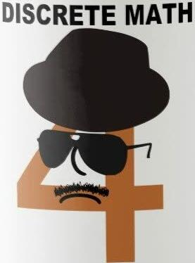
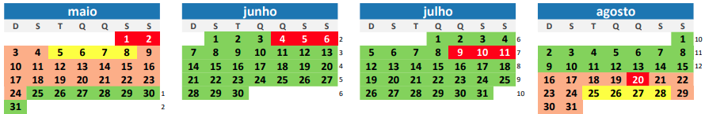
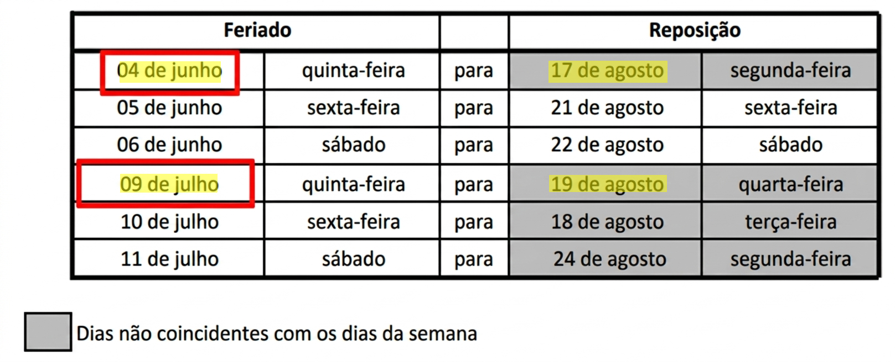
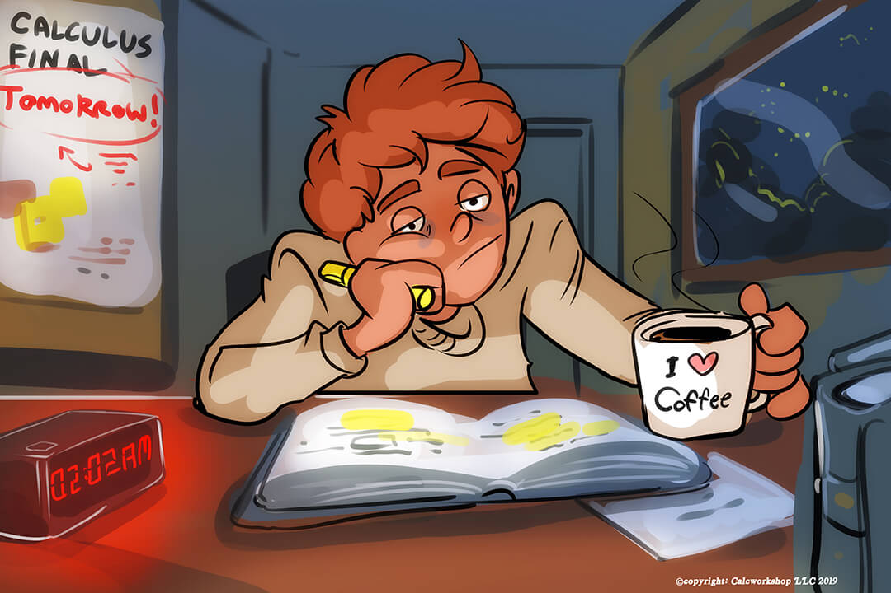
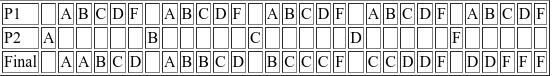

[[conceitos finais - manhã](https://docs.google.com/spreadsheets/d/e/2PACX-1vQtSPU1vGfmbpPxihr4Afz9vvWQ1wI-JhJ6UNk30IwRQdMW_PLAQ7SVbc_rRTnizaNclaGC9ms_yRCU/pubhtml?gid=1076248505&single=true)]

[[conceitos finais - noturno](https://docs.google.com/spreadsheets/d/e/2PACX-1vQtSPU1vGfmbpPxihr4Afz9vvWQ1wI-JhJ6UNk30IwRQdMW_PLAQ7SVbc_rRTnizaNclaGC9ms_yRCU/pubhtml?gid=1646961217&single=true)]

------

MCTB019-17 Matemática Discreta 2026-2

**Professor** [Jair Donadelli](http://hostel.ufabc.edu.br/~jair.donadelli)  ---  **email**  jair.donadelli @ ufabc.edu.br  —  **sala** 546-2 bloco A

------

Matemática Discreta (porém, exuberante) expõe o aluno aos princípios, técnicas e metodologias associadas a problemas em  estruturas matemáticas discretas.  O ***objetivo*** dessa disciplina é desenvolver no aluno a capacidade de construir demonstrações com uso de notação adequada e argumentação logicamente fundamentada, de entender a necessidade do rigor formal ao se argumentar, de interpretar problemas de contagem em termos matemáticos, aplicar técnicas  combinatórias, conhecer noções de cardinalidade em geral, reconhecer as diferenças entre estruturas discretas e contínuas e, em particular, desenvolver a capacidade de elaborar provas indutivas.

| Horários: | Sala: |
| :--- | :--- |
| **Diurno** QUI 8-10h, SEG 10-12h | A-108-0 |
| **Noturno** QUI 19-21h, SEG 21-23h | A-101-0(2ª), S-212- 0(5ª) |
| **Recomendação:** | **T-P-I:** |
| **F**unções de **U**ma **V**ariável | 4-0-0-\(\aleph_0\) |

## **Programação da disciplina**

### Ementa

Elementos de lógica clássica de primeira ordem. Teoria intuitiva dos conjuntos. Relações e grafos. Relações de equivalência. Relações de ordem. Funções. Técnicas de demonstração: prova direta, prova por contradição. Indução finita. Relações de recorrência. Cardinalidade: conjuntos finitos e infinitos; conjuntos enumeráveis e não enumeráveis. Princípios de contagem e combinatória. Princípio de inclusão e exclusão. Princípio das casas dos pombos.

### Bibliografia básica

- GRIMALDI, R.P. *Discrete and combinatorial mathematics : an applied introduction*. **[[510 GRIMdi5\] ](http://biblioteca.ufabc.edu.br/index.php?codigo_sophia=8910)**
- ROSEN, K.H. *Matemática discreta e suas aplicações*. 6ªEdição **[[510 ROSEma6\] ](http://biblioteca.ufabc.edu.br/index.php?codigo_sophia=13171)**

### Calendário e cronograma

**Reposição dos feriados:** 

#### Aulas

| Semana     | Tema principal                 | Tópicos          | Referências              | Atividades            |
| :--------: | ------------------------------ | ------------------------------ | ------------------------------ | ------------------------------ |
|   **01**   | Linguagem | Noções da Lógica: sentenças e conectivos;  predicados e quantificadores; implicação lógica; argumentos. Abordagem intuitiva de conjuntos. | - Seções 1.1 a 1.5, 2.1 e 2.2 de [Rosen 6ªed]  Cap 2, Seções 3.1-3.3 de [Grimaldi] -[Notas de aula](https://drive.google.com/file/d/1OftNrlBkzjKFdJ0P8AEiH7qvDPZXoB_g/view?usp=drive_link) | Exercícios (Rosen 6ªed., [respostas](https://drive.google.com/file/d/1ER5GF56GEFQ3bMXpY9tewawLzBaJFHIV/view?usp=drive_link) no livro) **[§1.1](https://drive.google.com/file/d/1Ceb2A-TTgbzVY6u_yPJbDMJP-IiNSyD-/view?usp=drive_link)**: 9,13,19,43, 45;  **[§1.2](https://drive.google.com/file/d/1yDIm_sT7wziS4JN7qAoTAi1BkydFGX3Y/view?usp=drive_link)**: 7,18,28,41,57; **[§1.3](https://drive.google.com/file/d/1_HFNyao1l_TW0eZ4tInz54nGU8_p9VH9/view?usp=drive_link)**: 7,15,17,21,25,39,52,53;  **[§1.4](https://drive.google.com/file/d/1U8f5w0aund88cJoMSRQcSLRKDA5NV73w/view?usp=drive_link)**: 1,3,13,25,31,39,47;  [**§1.5**](https://drive.google.com/file/d/1XdqVLLeLDID70rBqEMenG3HeEE2u4FiQ/view?usp=drive_link): 11,13,15,17,19,23,25,34; **[§2.1](https://drive.google.com/file/d/1AELBFGYFxQCsbvt07ZzCtPsl8I-eSu7s/view?usp=drive_link)**: 3,8,15,35; [**§2.2**](https://drive.google.com/file/d/12lN3AU6doEtxy6feA2B_G6lxFy-sjx8x/view?usp=drive_link): 45,47;  [Lista de exercícios](https://drive.google.com/file/d/15mqEomtWUrORT-jFW_afETB_a8wf4GMb/view?usp=drive_link) |
|   **02**   | Demonstrações | Métodos de prova (ênfase em $\Rightarrow$ e $\exists$) | - Seções 1.6 e 1.7 de [Rosen 6ªed]  -[Notas de aula](https://drive.google.com/file/d/1BtHu8y5yco4Pd2ky-06kD75nLpcpUYuu/view?usp=drive_link) | Exercícios (Rosen 6ªed., [respostas](https://drive.google.com/file/d/1ER5GF56GEFQ3bMXpY9tewawLzBaJFHIV/view?usp=drive_link) no livro) [**§2.2**](https://drive.google.com/drive/u/0/folders/1UKchwioaUbpsc1UjBWWQUlpQj9nvR6Ie): 5 a 13,23; [**§1.6**](https://drive.google.com/drive/u/0/folders/1UKchwioaUbpsc1UjBWWQUlpQj9nvR6Ie): 7,11,13,23,25,31,35,39 **[§1.7](https://drive.google.com/drive/u/0/folders/1UKchwioaUbpsc1UjBWWQUlpQj9nvR6Ie)** : 3,13,19,33.  [Videoaulas](https://www.youtube.com/playlist?list=PLkiKsK6sWsb8ZVC9yoszcIoo7hW-s8rkM) de BM sobre demonstrações  [Lista de exercícios](https://drive.google.com/file/d/1jV2OkVxD-d1uDtkKNY50doKLdwKHxpDV/view?usp=drive_link) |
| **03** | Indução e Boa ordem em $\mathbb N$ | Princípios de indução. Princípio da Boa Ordem. Indução em inteiros limitados inf. Provas usando indução. Armadilhas em provas por indução. Provas usando boa ordem. Variantes do PIF. Definições recursivas. | Seções 4.1-4.3 de [Rosen 6ªed] e de [Grimaldi]; -[Notas de aula](https://drive.google.com/file/d/1-52_VVUqZkiECFBwZHAPXAiNbRL6EPyb/view?usp=drive_link) | Exercícios (Rosen 6ªed., [respostas](https://drive.google.com/file/d/1ER5GF56GEFQ3bMXpY9tewawLzBaJFHIV/view?usp=drive_link) no livro) **[§4.1](https://drive.google.com/file/d/1wYJkgB6jUGxX12V6yUZtEq3onzvUkS3J/view?usp=drive_link)**: 3,9,19,35,41,53,79  **[§4.2](https://drive.google.com/file/d/1RNk13G_R7QhvDVZxCXvnjeNAdY3dpvAi/view?usp=drive_link)**: 11,27,29,36     [Lista de exercícios](https://drive.google.com/file/d/1XPwZHUB9SSzsxouowoIWunQR7WEGEY6D/view?usp=drive_link) |
| **04** | Conjuntos, Relações e Funções | Conjuntos de modo axiomático-informal. Dedução do PIF em ZFC Par ordenado e produto cartesiano: definição a partir dos axiomas. Relações; Rel. binárias e propriedades. Funções e propriedades. | -[Notas de aula](https://drive.google.com/file/d/10BVlRMdroet1zs8zZQL0k-bxTT7VSkrH/view?usp=drive_link) Seções iniciais dos caps. 2 e 8 de [Rosen 6ªed]  [Halmos] | [slide](https://drive.google.com/file/d/1JPWmi-byspz9kLGULs6_YCt_810PwWkH/view?usp=drive_link)  Exercícios (Rosen 6ªed., respostas no livro) **[§2.1](https://drive.google.com/file/d/1AELBFGYFxQCsbvt07ZzCtPsl8I-eSu7s/view?usp=drive_link)**: 5,6,7,9,21,23,27,28,30,32,37; **[§2.2](https://drive.google.com/file/d/12lN3AU6doEtxy6feA2B_G6lxFy-sjx8x/view?usp=drive_link)**: 29,49,50,51,53,57; [**§2.3**](https://drive.google.com/file/d/1XovZchZMPOAGsNORVsP1oly37pNfd4Rq/view?usp=sharing):1,5,12,13,15,16,23,31,36,39,67,76; **[§8.1](https://drive.google.com/file/d/1FKoOZsiCCmldYtzxqE-ZdM082uAzQct2/view?usp=drive_link)**:1,3,5,7,23; **[§8.4](https://drive.google.com/file/d/1quhhELGZAhrSfeNOQx3sggDlOssqoGr2/view?usp=drive_link)**: 29  [Lista de exercícios](https://drive.google.com/file/d/14ngd6FNyHqr1EzWmpmstBZGuXrokwruG/view?usp=drive_link) |
|   **05**   | Relações de equivalência | Relações de equivalência, Partições de conjuntos e equivalência entre eles. | Seções 8.4 e 8.5 de [Rosen 6ªed] ou 7.4 de [Grimaldi]. (notas de aula da semana passada) | Exercícios (Rosen 6ªed., [respostas no livro](https://drive.google.com/file/d/1ER5GF56GEFQ3bMXpY9tewawLzBaJFHIV/view?usp=drive_link)) **[§8.4](https://drive.google.com/file/d/1quhhELGZAhrSfeNOQx3sggDlOssqoGr2/view?usp=drive_link)**: 1,3,19,21 **[§8.5](https://drive.google.com/file/d/1pwnWsrJ0mMGTTOzLfPtMCLJSRe_oDzZD/view?usp=drive_link)**: 1,3,7,11,17,18,35,43,47-51.  [Lista de exercícios](https://drive.google.com/file/d/15FM4H2QKzKox_aoIvjFco1xy2Zt7jSe4/view?usp=drive_link) |
|   **06**   | Relações de ordem | Ordens parciais e totais. Cadeias; anticadeias; máximo e maximal. minimo e minimal. Diagrama de Hasse. | -[notas de aula](https://drive.google.com/file/d/1G76avww3StjORVQegy6xq1Ook57jPA2-/view?usp=drive_link)  -Seções 8.6 de [Rosen 6ªed] ou 7.3 de [Grimaldi]. | Exercícios (Rosen 6ªed., respostas no livro) **[§8.6](https://drive.google.com/file/d/1bOagkzEOYsWEUzEsixqOmd_AOaHJ2yTb/view?usp=drive_link)**: 1, 12, 13, 15, 19, 23, 28, 31, 33, 39, 41, 49 do Rosen (que chama conjunto parcialmente ordenado de *poset*)  [slides](https://drive.google.com/file/d/1F6CRlrBaQP-ecuxN35iSRdMrR4t0NLZ0/view?usp=drive_link) |
| **07** | Indução em boa ordem e ordem bem fundada | Indução em conjuntos bem ordenados e bem fundados. |  | Exercícios (Rosen 6ªed., respostas no livro) **[§8.6](https://drive.google.com/file/d/1bOagkzEOYsWEUzEsixqOmd_AOaHJ2yTb/view?usp=drive_link):** 53-57, 59, 60, 65 do Rosen. |
|   **08**   | **Avaliação** Indução estrutural | Indução e recursão estrutural. | P1: semanas 01 - 05 [-notas de aula](https://drive.google.com/file/d/1G76avww3StjORVQegy6xq1Ook57jPA2-/view?usp=drive_link)  | Exercícios (Rosen 6ªed., respostas no livro) **[§4.3](https://drive.google.com/file/d/1vZGCjU1VN3jx382R-crdzs0SXkh-eAYr/view?usp=drive_link):** 27, 29, 33-39, 41, 43-46, 48, 50, 51, 56, 57 da seção 4.3 do Rosen.  |
|   **09**   | Cardinalidade e contagem | Bijeções, cardinalidade, conjuntos finitos, enumeráveis e infinitos. Princípio das gavetas (ou casa dos pombos). | 1.1, 3.3, 5.5 e Ap. 3 de [Grimaldi]; final da seção 2.4, 5.1 e 5.2 de [Rosen]; [Notas de aula](https://drive.google.com/file/d/1FykKXBqWhOpgLZhx_3gMs7TjfOnndWEZ/view?usp=drive_link) | Exercícios (Rosen 6ªed., respostas no livro) **[§2.4](https://drive.google.com/file/d/1e4O_PoOQWt1VKZcPYVB1nfXHFAniQGhL/view?usp=sharing)** 31,33,37, 39,42,45,47 de [Rosen];  **[§5.2](https://drive.google.com/file/d/1b_kxMNfQVVOyPHal0pVuj4dR8G3l3fFZ/view?usp=drive_link)** 3, 8, 11, 25, 32, 42 de [Rosen] [Lista de exercícios](https://drive.google.com/file/d/1A98qEtcOa_qAdjUZ1z09yDvORtVOH7ET/view?usp=drive_link)  [slides](https://drive.google.com/file/d/1LZ7GaUJcKF1nsOyitGmc01_IvH6pAKNI/view?usp=drive_link) |
|   **10**   | Contagem e Combinatória | Princípios aditivo e multiplicativo. Combinação, arranjo, permutação. Solução inteira de equações. | Cap 1 de [Grimaldi], Cap 5 de [Rosen]. [Notas de aula](https://drive.google.com/file/d/1qEpz-xKPsYBxK5ZK9NfZAxF1G_jz3YGl/view?usp=drive_link) | Exercícios (Rosen 6ªed., [respostas](https://drive.google.com/file/d/1ER5GF56GEFQ3bMXpY9tewawLzBaJFHIV/view?usp=drive_link) no livro) **[§5.1](https://drive.google.com/file/d/1Ej23ghiMx1O70kCeA_cdH0v21vef0_az/view?usp=drive_link)**: 21, 29, 33, 35, 37, 39, 41, 45, 49, 55 **[§5.3](https://drive.google.com/file/d/1iyDEufETBvYU9KGzYziJ1t08OBctTGFX/view?usp=drive_link)**:   7, 11, 19, 23, 29, 35, 43, 44  **[§5.4](https://drive.google.com/file/d/1avjBXlYXPOZNwFVn4LirP8rHjTBefOJW/view?usp=drive_link)**:  9, 11, 13, 15, 17, 21, 27, 31, 33, 37 **[§5.5](https://drive.google.com/file/d/182fjyxohrCgX85spJNkGCzpZuVrq0z78/view?usp=drive_link)**:  7, 15, 16, 21, 23, 30, 31, 39, 42, 49, 50-55, 63   |
|   **11**   | Contagem e Combinatória | Inclusão--exclusão; binômio de Newton; coeficiente multinomial; relações de equivalência e contagem. | [Grimaldi], Cap 5 de [Rosen]. |  [Lista de exercícios](https://drive.google.com/file/d/11mF4gcSQMNFEzZPvXPIUSJCQ47ewwFL_/view?usp=drive_link) |
| **12** | **Avaliação** (5ª-f) |  | semanas 06 - 11 |  |
|  **13** semana de reposição  | **Avaliações substitutiva** (17/0**8**)  e  **recuperativa** (24/0**8**) |  |  |  |
|  |  |  |  |  |

###  Bibliografia complementar

 1.  Matosek, J. e Nesetril, J.I. *An Invitation to Discrete Mathematics* **[510 MATOin2]**
   2. Velleman, Daniel J *How to prove it : a structured approach* 2. ed. **[511.3 VELh2]**
   3. Mitchel T. Keller e William T. Trotter *Applied Combinatorics* **[[aqui](https://people.math.gatech.edu/~trotter/book.pdf)]**
   4. Halmos, Paul R. *Teoria ingênua dos conjuntos* **[[511.322HALt\]](http://biblioteca.ufabc.edu.br/index.php?codigo_sophia=2439)**
   5. Ronald L Graham; Donald E Knuth; Oren Patashnik.*Matemática concreta* 2. ed. **[510 GRAHma2]**

------

**Material de apoio**

R. Bianconi, [Como ler e estudar matemática?](http://www.ime.usp.br/~bianconi/recursos/mat.pdf) 

Fernando Q. Gouvêa e Shai Simonson, [How to Read Mathematics](http://web.stonehill.edu/compsci/history_math/math-read.htm) (uma tradução "rápida e grosseira", segundo o tradutor, [aqui](http://hostel.ufabc.edu.br/~daniel.miranda/?p=628)).

------

## **Atendimento**

*professor*:  546-2 bloco A  em qualquer horário, caso precise evitar desencontros combine um horário por email. Por motivos burocráticos reservo os seguinte horários  2ª 12h-13h,  5ª 10h-12h, 16h-18h.

#### Monitoria

*monitores*:  Leonardo e Pedro; [locais e horários de atendimento](https://docs.google.com/spreadsheets/d/1eHbYH1uvNRV_KHJwAuNcYWSiY2l8QMThV6P4Y6dhCp8/edit?usp=sharing).

------

## **Avaliação**

2 **provas**. 

As avaliações são individuais, presenciais e sem consulta. 

Os critérios de avaliação incluem, de acordo com os objetivos da disciplina

1.  Apresentação clara, legível, discursiva, uniforme e objetiva.
2.  Construção correta e em ordem dos argumentos.
3.  Atendimento às normas de correção ortográfica e gramatical.
4.  Observância às orientações específicas da atividade quando for o caso.

Serão atribuídos conceitos nas atividades avaliativas e o resultado é definido como segue:

### Recuperação

Tem direito ao exame recuperação, o qual engloba todo o conteúdo da disciplina, aqueles que foram aprovado com D ou reprovado com F e obtiveram frequência mínima.  O resultado do exame é um conceito que compõe com o conceito final **M** obtido na avaliação regular da disciplina como segue:

O aluno deve manifestar interesse em fazer a recuperação de acordo com as instruções que serão enviadas pelo siga em momento apropriado durante a disciplina.

## **Links** (provas antigas e outros)

1. Material antigo: [Provas](https://drive.google.com/drive/folders/1nw_n9APcyIBohGt8ZRg59fS_jUpNEhTD?usp=sharing), [listas](https://drive.google.com/drive/folders/1cOzmxCBJfYMiaLB7AbmDddCfGp6c34w-?usp=sharing), [slides](https://drive.google.com/drive/folders/1MsCP132CI9uwO0Ok3RzXnKMWgJbjx6NR?usp=sharing), [Notas de aulas](https://drive.google.com/drive/folders/1lpIok5SnUaoUyV6BBIu1lGEct_sarTuE?usp=sharing)
2. [Matemática discreta](https://en.wikipedia.org/wiki/Discrete_mathematics), entrada no wikipedia (em inglês, a página em português não está boa).
3. Lásló Lovász, [Discrete and Continuous: Two sides of the same?](http://www.cs.elte.hu/~lovasz/telaviv.pdf).
4. [The Banach–Tarski Paradox](https://www.youtube.com/watch?v=s86-Z-CbaHA&t=58s) (Video) 
5. *Foolproof: A Sampling of Mathematical Folk Humor* Paul Renteln and Alan Dundes. [[pdf](http://www.ams.org/notices/200501/fea-dundes.pdf)]
6. [Mathematical Writing](https://jmlr.csail.mit.edu/reviewing-papers/knuth_mathematical_writing.pdf). Donald E. Knuth e outros
7. [How to write mathematics](https://entropiesschool.sciencesconf.org/data/How_to_Write_Mathematics.pdf), Paul Halmos

------

