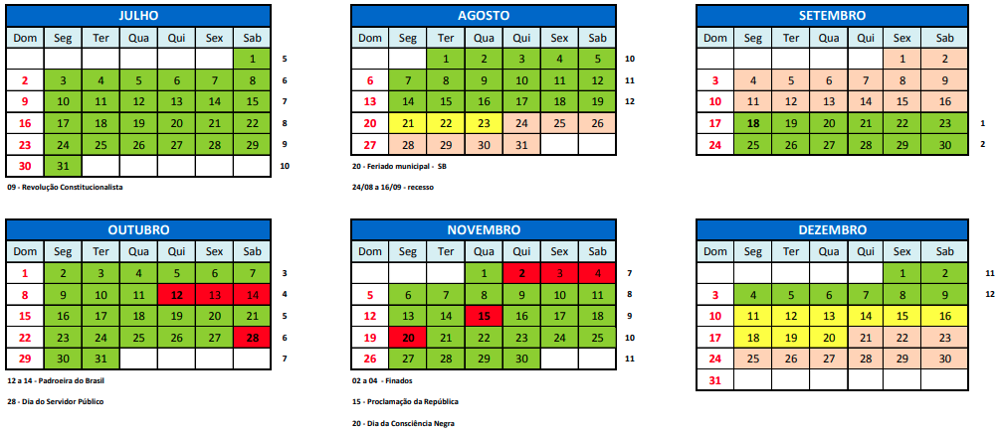
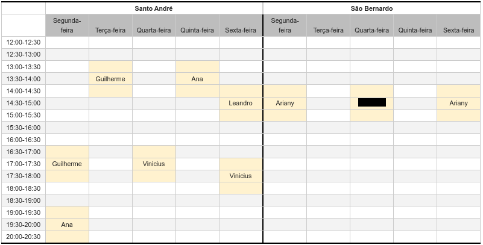

[ultima atualização 27/11] - [Notas](https://docs.google.com/spreadsheets/d/13c-rr7iYTpuHK2Msq2HrxIsxg53blCnw/edit?usp=drive_link&ouid=102558933541956705508&rtpof=true&sd=true)

# Funções de uma variável 2023 - 3

**Professor** Jair Donadelli   ---  **email**  jair.donadelli 'arroba' ufabc. ...

---

Esta disciplina sistematiza a noção de [**função**](https://www.youtube.com/watch?v=PAZTIAfaNr8) de uma variável real e introduz os fundamentos do cálculo diferencial e integral. Espera-se que ao final o aluno compreenda os conceitos de derivada e integral; seja capaz de: demonstrar pela definição casos simples de derivadas e integral; utilizar técnicas para o cálculo de derivadas e integrais; utilizar as informações fornecidas pelas derivadas (primeira e segunda) e limites na construção do esboço do gráfico de uma função real; utilizar linguagem matemática na modelagem/resolução de situações problemas envolvendo os conceitos de limite, derivadas e integrais. Em  especial, nos problemas de otimização de uma variável e no cálculo de áreas.

**Sempre fique atento ao seu *email institucional*.**

**T-P-I**: 4-0-**6**

**Disciplina prévia recomendada:** *Bases Matemáticas* - faremos uso frequente dos conceitos de BM por todo o desenvolvimento de FUV. [A todos é recomendado uma revisão](https://drive.google.com/file/d/1_E3dvjmKD9yPs7htm6UJ_L_58Puw374q/view). Aqueles que reconhecem deficiência/dificuldade devem procurar ajuda do professor ou dos monitores.

O **horário** semanal é:

- terça das 08:00 às 10:00, sala A-103-0, quinta das 10:00 às 12:00, sala A103-0

**Presença** nas  aulas: Este é um curso presencial, com duas aulas semanais. Para aprovação, é necessária  presença em pelo menos 75% das aulas. Ou seja, o número máximo de faltas é seis dias.

**Páginas da disciplina unificada**:
■ *Moodle* https://moodle.ufabc.edu.br/course/view.php?id=5235   para os **testes**.

■ *Gradmat* http://gradmat.ufabc.edu.br/disciplinas/fuv/. material adicional sobre a disciplina, incluindo sugestões adicionais de bibliografia e **listas de exercícios**.

Mais informação, siga o índice abaixo:

[toc]

## **Programação**

### Ementa

**Derivadas**: Derivadas. Interpretação Geométrica e Taxa de Variação. Regras de derivação. Derivadas de funções elementares. Derivadas de ordem superior. Diferencial da função de uma variável. Aplicações de derivadas. Fórmula de Taylor. Máximos e mínimos, absolutos e  relativos. Análise do comportamento de funções através de derivadas. Regra de L’Hôpital. Crescimento, decrescimento e concavidade. Construções de gráficos. 
**Integrais**: Integral definida. Interpretação geométrica. Propriedades. Antiderivada e Integral indefinida. Teorema fundamental do cálculo. Aplicações da integral definida. Técnicas de Primitivação: técnicas elementares, mudança de variáveis, integração por partes, integração de funções racionais por frações parciais e Integrais trigonométricas. Aplicações ao cálculo de áreas e volumes. 

### Bibliografia

STEWART, J. Cálculo, vol I, Editora Thomson 2009. [Nº de chamada na biblioteca 515 STEWca4]

GUIDORIZZI, H. L. Um curso de cálculo, vol. 1. Rio de Janeiro: LTC, 2021. [Nº de chamada na biblioteca 515 GUIDcu6]

##### [Notas de aula](https://drive.google.com/file/d/1dndFykK8wBE6xB6pciJ6PI4M5TXcoJTf/view?usp=sharing) 

(link para notas da última oferta, será atualizada no decorrer do quadrimestre)

### Cronograma

| Semana      | Conteúdo                                                     | Atividades                                                   |
| ----------- | ------------------------------------------------------------ | ------------------------------------------------------------ |
| **1 **      | **Aula 1**. ■ Derivada: motivações, definição, interpretação gráfica e propriedades. ■ Derivadas laterais. **Aula 2**. ■ Derivada das funções clássicas ($x^n, \sqrt{x},1/x^n,\sin(x),\cos(x),\ln(x)$ ■ Regras de derivação: derivadas da soma, do produto e do quociente de funções. | **Leitura:** ■ STEWART, J. – Cálculo - Volume 1. Seções 2.7, 2.8, 3.1, 3.2 e 3.3 ■  Notas aula e lista de exercícios: [derivadas](https://drive.google.com/file/d/1wSNFv4fH5YVsAY63f3rYmNA3ykb3z01B/view?usp=sharing) (lista nas páginas finais do pdf) **Vídeos**: ■ Derivada: motivação e exemplos ■ Definição de derivada ■ Derivadas das funções clássicas ■ Regras de diferenciação |
| **2**       | **Aula 1.** ■ Regra da cadeia. ■ Derivada de funções inversas.  ■ Derivação implicita.  **Aula 2** ■ Derivação de funções exponenciais, logarítmicas e trigonométricas inversas. ■[Funções hiperbólicas](https://www.youtube.com/watch?v=JdC67b0tab4&t=345s) (video, 8min) ■ Taxas de variação. | **Vídeo:** [Funções hiperbólicas](https://www.youtube.com/watch?v=JdC67b0tab4&t=345s) (8min) **Leitura:** ■ STEWART, J. – Cálculo - Volume 1. Seções 3.4 a 3.8 ■  Notas aula e lista de exercícios: [taxa de variação e regras de derivação](https://drive.google.com/file/d/1Ti29f6giGFpk4nmmrOxvCAH8NJcRGtrc/view?usp=drive_link) (lista nas páginas finais do pdf) **Vídeos**: ■ Regra da cadeia ■ Exercícios de regra da cadeia ■ Derivada da função inversa e derivação implícita ■ Diferenciação implícita: exemplos ■ Taxa de variação **Avaliação**: **Teste 1** |
| **3**   | **Aula 1**. ■ [Derivadas de ordens superiores](https://www.youtube.com/watch?v=y3pwMlJqjnA). ■ Taxas relacionadas. **Aula 2**. ■ Aproximação linear e diferenciais. ■ Pols. de Taylor ■ Máximos e mínimos, local e global(ou relativos e absolutos). Definições, interpretações gráficas e propriedades. | **Videos:** [derivadas de ordens superiores](https://www.youtube.com/watch?v=y3pwMlJqjnA&list=PLsY9T-5TmwNsulD5VpRheKaDlzX7RLEW0&index=14)(18min); **leitura:** STEWART, J. - Cálculo, Vol. 1 seções: 3.9, 3.10 3.10, 3.11,4.1   **Notas de aula e lista de exercícios:** [Taxas relacionadas e aproximações locais](https://drive.google.com/file/d/1WIUHH5scin1TE4k8ZqF3IaTkutavfiN8/view?usp=drive_link) (Lista nas pags finais do pdf)(aproximação quadrática e Polinômios de Taylor foi apenas comentado em aula) **Vídeos**: ■ Taxas relacionadas I, II ■ Exemplo de taxas relacionadas ■ Derivadas de ordem superior ■ Linearização ■ [Diferencial de uma função](https://www.youtube.com/watch?v=TXwAfDDZ4ls&list=PLsY9T-5TmwNsulD5VpRheKaDlzX7RLEW0&t=1s) ■ Máximos e mínimos |
| **4**       | **Aula 1**. ■ Máximos e mínimos em intervalos abertos. Teorema de Fermat. ■ Máximos e mínimos  em intervalos fechados. Teorema de Weierstrass. ■ Teorema do Valor Médio.  | **leitura:** STEWART, J. - Cálculo, Vol. 1 seções: 4.1 a 4.4  **Notas de aula e lista de exercícios**  [Máximos e mínimos. TVM](https://drive.google.com/file/d/1aBwVza5ewyje1PTIkcVKLFsQdBp4mYAP/view?usp=drive_link) (no final do pd, lista  exercícios) **Vídeos**: ■ Teorema do Valor Médio I e II  ■ Teorema dos valores extremos de Weierstrass ■ Teorema de Fermat  **Avaliação : Teste 2** |
| **5**       | **Aula 1**. ■ Como as derivadas afetam a forma do gráfico. Crescimento, decrescimento e concavidade. ■ Assíntotas. **Aula 2**. ■ Esboço de gráficos. ■ Problemas de otimização. | **leitura:** STEWART, J. - Cálculo, Vol. 1 seções: 4.5 a 4.7  **Notas de aula e lista de exercícios**: [Gráficos e Otimização](https://drive.google.com/file/d/1a5U0AIt4nIG2kEeE6s9dqVjJEFFQPQQN/view?usp=drive_link) **Vídeos**: ■ Crescimento, decrescimento e o teste da primeira derivada ■ Teste da segunda derivada ■ Concavidade de uma função ■ Assíntotas ■ Roteiro para o esboço de gráficos ■ Esboço de gráfico I, II e III ■ Problemas de otimização I e II ■ Problema de otimização: Lei de Snell  ■ Problema de otimização: cone de menor volume contendo uma esfera ■ Problema de otimização: distância de ponto a reta |
| **6 **      | **Aula 1**. ■ Formas indeterminadas e a regra de L’Hôpital. (Regra de L’Hospital, videos: [parte 1]( https://www.youtube.com/watch?v=7lrINzobjZMI), [parte II](https://www.youtube.com/watch?v=Cf3I6J_HStY) e [parte III](https://www.youtube.com/watch?v=Cf3I6J_HStY&list=PLsY9T-5TmwNvpNHfOFS-ZnmMqBT1XiD_S&index=10) ) ■ Antiderivadas. Introdução a equações diferenciais e problemas de valores iniciais. **Aula 2.** ■ **Prova 1** | **leitura**: Stewart, J. - Cálculo, Vol. 1 seções: 4.9  **Notas de aula e exercícios:** [Antiderivada](https://drive.google.com/file/d/1JWFlsVPPyjsogyEcGDD344NDSlPT74kA/view?usp=drive_link) (L'hopital está na nota da semana 4) **Vídeos**: ■ Antiderivada ou primitiva de uma função ■ Introdução às equações diferenciais ordinárias **Avaliações** ■ I**Prova 1**  (quinta)  ■ I**Teste 3** |
| **7**       | **Aula 1**. ■ Áreas e somas de Riemann. ■ Integral definida. | **leitura:** STEWART, J. – Cálculo - Volume 1. Seções 5.1 e 5.2. [Somatório](https://drive.google.com/file/d/14QuUxcHEVCzGThI4L9bhlPQrZCZNo85R/view?usp=sharing), seção do livro do Anton Howard **Notas de aula e lista de exercícios:** I[ntegral definida](https://drive.google.com/file/d/1-hvqe9QBxIfg-XbAFljUhkFFbPcUiRe7/view?usp=drive_link) **Vídeos**: ■ Áreas e somas de Riemann ■ Integral definida ■ Propriedades da integral definida |
| **8**       | **Aula 1**. ■ Propriedades da Integral definida. ■ Teorema Fundamental do Cálculo. **Aula 2**. ■ Métodos de integração: integração por mudança de variável e por partes. | **leitura:** Stewart, J. - Cálculo, Vol. 1 seções: 5.1, 5.2, 5.3, 5.4 e 5.5, 6.1 e 7.1  **notas de aula e lista de exercícios**: [TFC e técnicas de integração](https://drive.google.com/file/d/1Z1kfymj1nTx2FJWCLAG2zowYt0Wmi_gt/view?usp=drive_link) **Vídeos**: ■ Primeiro Teorema Fundamental do Cálculo ■ Segundo Teorema Fundamental do Cálculo ■ Método de integração por substituição ■ Método de integração por partes  **Avaliação Teste 4** |
| **9**       | **Aula 1**. ■ Áreas entre duas curvas ■ Centro de massa. ■ [Trabalho](https://www.youtube.com/watch?v=S1szTNS1kTg). **Aula 2**. ■ Volumes de um sólido de revolução: cascas cilíndricas. ■ Volumes de um sólido de revolução: seções transversais | **leitura:** STEWART, J. – Cálculo - Volume 1. Seções 6.1 a 6.5 **Videos:**[área entre curvas integrando em $y$](https://www.youtube.com/watch?v=txw8D-M0cb8&list=PLsY9T-5TmwNuPbT6xFcIzWtsdfpiSqQAd&index=3),  **Notas de aula e lista de exercícios**: [Aplicações](https://drive.google.com/file/d/18P0Y6dtqwovOZKXviR1Ck-bK4wJU6WzU/view?usp=drive_link)   **Vídeos**: ■ Áreas entre duas curvas I e II ■ Trabalho. ■ Cálculo do volume por seções transversais ■ Volume de sólidos de revolução ■ Volume por cascas cilíndricas ■ Centro de massa ■ Segundo Teorema de Pappus |
| **10**      | ■ Substituição Trigonométrica. ■ Integrais Trigonométricas.  | **leitura:**  STEWART, J. – Cálculo - Volume 1. Seções 7.2,7.3 e 7.8 **Notas de aula e lista de exercícios**: [integrais trigonométricas](https://drive.google.com/file/d/1So4uhn81BjuEskW29r08hB795qeDBcVI/view?usp=drive_link)  **Avaliação - Teste 5**  **Vídeos:** ■ Integrais trigonométricas I e II ■ Substituição trigonométrica I e II  |
| **11**      | **Aula 1**. ■ Integração de funções racionais por frações parciais. **Aula 2**. ■ Integrais impróprias. ■ Comprimento de arco.  | **leitura:** ■ STEWART, J. – Cálculo - Volume 1. Seções 7.8 e 8.1; extra: Seções 8.2, 8.3, 8.4 e 8.5 ■ [**Estratégia de Integração**](http://hostel.ufabc.edu.br/~daniel.miranda/calculo/estrategia.html#/) **Notas de aula**: integrais impróprias e frações parciais **Vídeos**: ■ [Integração de funções racionais por frações parciais I.](https://www.youtube.com/watch?v=e5Hoh_To7dk) ■ [Integração de funções racionais por frações parciais II](https://www.youtube.com/watch?v=Rfhy9k6MFrk&t=888s). ■ Comprimento de arco ■ Integrais impróprias I e II  |
| **12**      | **Avaliação**                                                | **Prova 2**(terça) **Prova Sub**(quinta) **Teste 6** |
|             | Aula de reposição de 2/11 no dia 14/12, quinta-feira, as 10h | **Recuperação**                                              |

## **Atendimento e Monitoria**

**Docente:**  Sala 546-2. Horário preferencial 2ª 18h ; 3ª 10h; ou em horário combinado por email (presencial ou online)

**Monitoria:** **Campus SBC**: Alfa 2, sala 309; **Campus SA:** Sexta-feira 14:00 na 302-2, demais horários na 302-3

**OBS** A partir da 1ª semana de outubro tivemos uma pequena mudança na monitoria em São Bernardo,  o monitor Leandro atenderá online (síncrono) às quartas-feiras às 19h na sala https://conferenciaweb.rnp.br/sala/leandro-39.

## **Avaliação**

O método avaliativo consistirá de 6 **testes** periódicos disponibilizados no *Moodle* pela coordenação da disciplina e 2 **provas** presenciais nas semanas 6 e 12. 

##### Testes

■ Serão aplicados 6 testes, quizenalmente, nas semanas pares: 2, 4, 6, 8, 10, e 12.
■ Cada teste é uma atividade não cronometrada, composta por 6 a 8 questões objetivas.
■ Os testes serão disponibilizados às segundas-feriras (0h), ficando abertos por sete dias (até
às 23h59 do domingo seguinte).

*O que é permitido e o que não é permitido durante os testes*
O que **pode**:
• Consultar monitores da disciplina.
• Consultar colegas da disciplina.
• Consultar docentes da equipe.
O que **não pode**:
• Divulgar sistematicamente as respostas dos testes por qualquer meio físico ou virtual.

------

O **Código de Ética da Universidade Federal do ABC** estabelece em seu Artigo 25 que: Quanto aos trabalhos acadêmicos, é eticamente inaceitável que os discentes:
**I** fraudem avaliações;
**II** fabriquem ou falsifiquem dados;
**III** plagiem ou não creditem devidamente autoria;
**IV** aceitem autoria de material acadêmico sem participação na produção;
**V** vendam ou cedam autoria de material acadêmico próprio a pessoas que não participaram
da produção.

Qualquer violação às regras implicará: Reprovação automática por nota e frequência, com conceito O. Possível denúncia à Comissão de Transgressões Disciplinares Discentes da Graduação.  Possível denúncia apresentada à Comissão de Ética da UFABC, de acordo com o artigo 25 do Código de Ética da UFABC.

------

##### Conceito final 

Nas provas são atribuídas notas inteiras de 0 a 100. A média final não será inferior a: 
$$
\mathbf{M}= \max\left\{ \frac{P_1+P_2}2 , \;0{,}25 × \frac{\sum_i T_i}6 + 0{,}85 × \frac{P_1+P_2}2\right\}
$$
O conceito final na disciplina é dado de acordo com a seguinte tabela:

| Conceito | Intervalo        |
| -------- | ---------------- |
| A        | $M\geq 85$       |
| B        | $70\leq M<85$    |
| C        | $50\leq M < 70$  |
| D        | $45 \leq M < 50$ |
| F        | $M < 45$         |

### Substitutiva 

O aluno que perder uma prova **por razão justificada e de acordo com o [regimento da UFABC ](https://www.ufabc.edu.br/images/consepe/resolucoes/resolucao_227_-_regulamenta_a_aplicacao_de_mecanismos_de_avaliacao_substitutivos_nos_cursos_de_graduacao_da_ufabc_revoga_e_substitui_a_resolucao_consepe_n_181.pdf)**deve apresentar justificativa e manifestar o interesse em realizar uma prova substitutiva.

### Recuperação 

Engloba *todo* o conteúdo da disciplina para aqueles alunos com conceito final D ou F e obtiveram frequência mínima. Data 14/12. Os alunos que têm intenção de fazer a Rec devem deixar o nome nesse link:  [Formulário](https://forms.gle/htDXZHjd4bSXQvQk7); **até 12/12**. 

