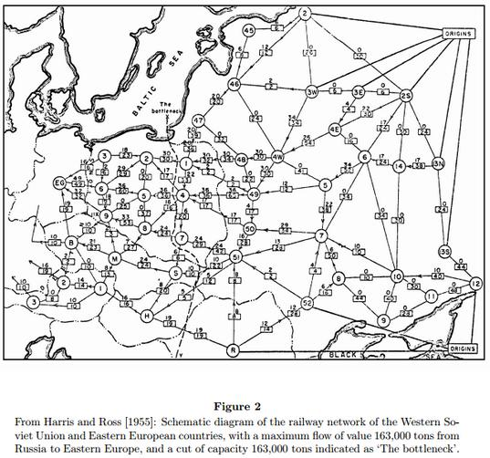

MCCC003-23 Algoritmos em Grafos 
2026-3

    <a href="http://hostel.ufabc.edu.br/~jair.donadelli">Jair Donadelli</a> --- jair.donadelli&#64;ufabc.edu.br --- Sala 546 Torre 2 Bloco A 
    3ª 8h00 sala A-102-0 e 5ª 10h00 sala A-102-0 

 

------

Nesta disciplina, apresentamos conceitos básicos da teoria dos grafos e como representar um grafo computacionalmente, apresentamos algoritmos eficientes para problemas clássicos em grafos e discutimos os tempos de execução e a correção dos algoritmos estudados.

Espera-se que ao final da disciplina o aluno seja capaz de modelar problemas em grafos, que o aluno conheça os principais problemas em grafos e os algoritmos eficientes que os resolvem. Espera-se também que o aluno tenha noções da complexidade de tempo de execução dos algoritmos cobertos ao longo do curso. 

| Recomendações: | T-P-E-I: | Céditos | CH |
| :--- | :--- | ---- | ---- |
| Matemática Discreta I e II. Algoritmos e Estruturas de Dados I e II. | 4-0-0-4 | 4 | 42h |

------

**E-mails:** Toda comunicação ‘aluno → professor’ por email deve ser com o endereço oficial.

Os comunicados gerais ‘professor → aluno’ serão pelo sigaa.

------

### Ementa

Revisão da terminologia básica de Teoria dos Grafos. Noções de análise de algoritmos. Estruturas de dados para representação de grafos. Buscas em largura e profundidade e suas aplicações: caminhos mínimos sem pesos, componentes conexas. Grafos ponderados. Árvores geradoras mínimas: algoritmos de Prim e Kruskal. Grafos Eulerianos e Hamiltonianos. O Problema do Caixeiro Viajante. Digrafos: definições básicas, componentes fortemente conexas e ordenação topológica. Caminhos mínimos em digrafos ponderados: algoritmos de Dijkstra, Bellman-Ford e Floyd–Warshall. Fluxo máximo: algoritmo de Ford-Fulkerson e suas aplicações.

### Bibliografia básica

- BONDY, J. A.; MURTY, U. S. R. *Graph theory*. New York: Springer, 2008. (Graduate Texts in Mathematics, v. 244).
- ERICKSON, Jeff. *Algorithms*. 1. ed. [S. l.], 2019. Capítulos 5 a 11. Disponível em: [https://jeffe.cs.illinois.edu/teaching/algorithms/](https://jeffe.cs.illinois.edu/teaching/algorithms/index.html). 
- CORMEN, Thomas H.; LEISERSON, Charles E.; RIVEST, Ronald L.; STEIN, Clifford. *Algoritmos: teoria e prática*. 3. ed. Rio de Janeiro: Elsevier, 2012.

####  Bibliografia complementar

1.  DIESTEL, R. *Graph Theory*. 6. ed. Heidelberg: Springer-Verlag, 2025.
2.  SEDGEWICK, Robert. *Algorithms in C, Part 5: Graph Algorithms*. 3. ed. Reading, USA: Addison Wesley Professional, 2002.
3.  DASGUPTA, Sanjoy; PAPADIMITRIOU, Christos H.; VAZIRANI, Umesh V. *Algorithms*. Boston, USA: McGraw-Hill, 2008.
4.  David JOYNER, Minh VAN NGUYEN, Nathann COHEN. *Algorithmic Graph Theory*, [online](https://static.latexstudio.net/wp-content/uploads/2013/03/book.pdf), 2013.
5.  Tim ROUGHGARDEN, *Algorithms Illuminated, Part 2: Graph Algorithms and Data Structures*, [online](https://www.rexresearch1.com/AlgorithmLibrary/AlgorithmsIlluminated2Roughgarden.pdf),  2018.
6.  BRASSARD, Gilles; BRATLEY, Paul. *Fundamentals of algorithmics*. Englewood Cliffs: Prentice Hall, 1996.
7.  MANBER, Udi. *Introduction to algorithms: a creative approach*. Addison-Wesley.

------

## **Programação da disciplina**

***Reposição dos feriados***: **não há**

### Programação das aulas

| Semana | Tema principal                           | Tópicos                                                      | Referências                            | Atividades de leitura obrigatória                            |
| ------ | ---------------------------------------- | ------------------------------------------------------------ | -------------------------------------- | ------------------------------------------------------------ |
| **01** | Fundamentos                              | Terminologia básica: grafos; adjacência; grau; subgrafos; passeios, trilhas, caminhos, cicuitos e ciclos; | Bondy & Murty; Erickson; Cormen et al. | [Notas de aula](semana1.pdf)  [Lista 1](lista1.pdf)    |
| **02** | *Congresso UFABC*                        | *não há aula*                                                | —                                      | —                                                            |
| **03** | Representação                            | Isomorfismo; representações por matriz e lista de adjacência; noções de análise de algoritmos. Buscas. | Erickson; Cormen et al.                | [Notas de aula](semana2.pdf) [Notas de aula](semana3.pdf)  |
| **04** | Busca em largura e busca em profundidade | Busca em largura (BFS); busca em profundidade (DFS); Caminhos mínimos em grafos não ponderados; | Erickson; Cormen et al.                | [Notas de aula](semana3.pdf)  [Lista 2](lista2.pdf)  |
| **05** | Árvores geradoras mínimas                | Árvores, florestas. Grafos ponderados; árvores geradoras; problema da árvore geradora mínima. Algoritmos de Prim e Kruskal. | Erickson; Cormen et al.; Bondy & Murty | [Notas de aula](semana4.pdf)  Lista 3                |
| **06** | Grafos Eulerianos, Hamiltonianos e TSP   | Trilhas e ciclos eulerianos; caminhos e  circuitos hamiltonianos | Bondy & Murty; Erickson                | Notas de aula                                                |
| **07** | **P1** e Digrafos e ordenação topológica | Digrafos; graus de entrada e saída; DAGs; ordenação topológica; componentes fortemente conexas | Bondy & Murty; Erickson; Cormen et al. | Notas de aula  Lista 4                               |
| **08** | Caminhos mínimos em digrafos             | Problema dos caminhos mínimos; relaxação; propriedades de caminhos mínimos; pesos não negativos; algoritmo de Dijkstra. | Erickson; Cormen et al.                | Notas de aula  Lista 5                               |
| **09** | Caminhos mínimos em digrafos II          | Pesos negativos; ciclos negativos; caminhos mínimos de uma origem; caminhos mínimos entre todos os pares; algoritmo de Floyd–Warshall. | Erickson; Cormen et al.                | Notas de aula                                                |
| **10** | Fluxo máximo                             | Redes de fluxo; capacidades; conservação de fluxo; fluxos e cortes; caminhos aumentantes; | Erickson; Cormen et al.                | Notas de aula  Lista 6                               |
| **11** | Fluxo máximo                             | algoritmo de Ford-Fulkerson; fluxo máximo e corte mínimo     |                                        |                                                              |
| **12** | **P2** e **Sub**                         |                                                              |                                        |                                                              |
| **13** | **Avaliação recuperativa**               |                                                              |                                        |                                                              |

[NOTAS DE AULA](NOTAS.pdf) em único arquivo pdf (contruída no decorrer da disciplina)

### Atendimento

Terças das 10h às 12h ou em horário previamente combinado pessoalmente ou por email.

------

## **Avaliação**

2 **provas**: 29/10 (conteúdo até semana 06) e 01/12 (conteúdo todo, principalmente a partir da P1). 

As avaliações são individuais, presenciais e sem consulta. 

Na correção das avaliações serão considerados:

1.  Apresentação clara, legível, discursiva, uniforme, objetiva das soluções dos problemas.
2.  Atendimento às normas de correção ortográfica e gramatical.
3.  Observância às orientações específicas da atividade/exercício.

#### Conceito final 

Nas avaliações serão atribuídos concentos cujo resultado, ao final da disciplina,  será de acordo com a seguinte tabela (P2 tem peso maior)

<figure class="table-figure">
  <table>
    <thead>
      <tr>
        <th>P1</th>
        <th>&nbsp;</th>
        <th>A</th>
        <th>B</th>
        <th>C</th>
        <th>D</th>
        <th>F</th>
        <th>&nbsp;</th>
        <th>A</th>
        <th>B</th>
        <th>C</th>
        <th>D</th>
        <th>F</th>
        <th>&nbsp;</th>
        <th>A</th>
        <th>B</th>
        <th>C</th>
        <th>D</th>
        <th>F</th>
        <th>&nbsp;</th>
        <th>A</th>
        <th>B</th>
        <th>C</th>
        <th>D</th>
        <th>F</th>
        <th>&nbsp;</th>
        <th>A</th>
        <th>B</th>
        <th>C</th>
        <th>D</th>
        <th>F</th>
      </tr>
    </thead>
    <tbody>
      <tr>
        <td><strong>P2</strong></td>
        <td><strong>A</strong></td>
        <td>&nbsp;</td>
        <td>&nbsp;</td>
        <td>&nbsp;</td>
        <td>&nbsp;</td>
        <td>&nbsp;</td>
        <td><strong>B</strong></td>
        <td>&nbsp;</td>
        <td>&nbsp;</td>
        <td>&nbsp;</td>
        <td>&nbsp;</td>
        <td>&nbsp;</td>
        <td><strong>C</strong></td>
        <td>&nbsp;</td>
        <td>&nbsp;</td>
        <td>&nbsp;</td>
        <td>&nbsp;</td>
        <td>&nbsp;</td>
        <td><strong>D</strong></td>
        <td>&nbsp;</td>
        <td>&nbsp;</td>
        <td>&nbsp;</td>
        <td>&nbsp;</td>
        <td>&nbsp;</td>
        <td><strong>F</strong></td>
        <td>&nbsp;</td>
        <td>&nbsp;</td>
        <td>&nbsp;</td>
        <td>&nbsp;</td>
        <td>&nbsp;</td>
      </tr>
      <tr>
        <td><strong>Final</strong></td>
        <td>&nbsp;</td>
        <td><strong>A</strong></td>
        <td><strong>A</strong></td>
        <td><strong>B</strong></td>
        <td><strong>B</strong></td>
        <td><strong>C</strong></td>
        <td>&nbsp;</td>
        <td><strong>A</strong></td>
        <td><strong>B</strong></td>
        <td><strong>B</strong></td>
        <td><strong>C</strong></td>
        <td><strong>D</strong></td>
        <td>&nbsp;</td>
        <td><strong>B</strong></td>
        <td><strong>C</strong></td>
        <td><strong>C</strong></td>
        <td><strong>C</strong></td>
        <td><strong>F</strong></td>
        <td>&nbsp;</td>
        <td><strong>D</strong></td>
        <td><strong>D</strong></td>
        <td><strong>F</strong></td>
        <td><strong>F</strong></td>
        <td><strong>F</strong></td>
        <td>&nbsp;</td>
        <td><strong>F</strong></td>
        <td><strong>F</strong></td>
        <td><strong>F</strong></td>
        <td><strong>F</strong></td>
        <td><strong>F</strong></td>
      </tr>
    </tbody>
  </table>
</figure>

**Frequência mínima** de 75%, caso contrário o conceito final é **O**.

### Instruções para as provas

1. *Podem* utilizar lápis, desde que a escrita seja legível, ou caneta, exceto na cor vermelha.

2. *Podem* responder às questões em qualquer ordem.

3. *Podem* usar parte da folha de resposta como rascunho, identificando-a no topo da página com a palavra Rascunho.

4. *Podem* entregar a prova a qualquer momento, desde que assinem a lista de presença.

5. *Devem* trazer um documento com foto atual.

6. *Devem* deixar as mochilas no chão, com o celular dentro (desligado ou silenciado). É **proibido** o uso de eletrônicos (celular, calculadoras, smartwatches,  etc), bem como bonés e chapéus.

7. *Devem* entregar a folha de questões juntamente com a folha de respostas.

8. *Devem* deixar sobre a carteira **somente** lápis, caneta, borracha, documento e garrafa d'água. Qualquer outro objeto deve ser guardado.

9. Ida ao banheiro apenas mediante a entrega definitiva da prova.

10. Todo aluno poderá, eventualmente e a critério do professor, ser arguido oralmente sobre as soluções apresentadas na prova e essa arguição será parte da avaliação.

​        **O não cumprimento das instruções implica anulação da prova.** 

​        **Na constatação de fraude, o aluno será *reprovado*.**

------

#### O Código de Ética da Universidade Federal do ABC

Estabelece em seu Artigo 25 que, quanto aos trabalhos acadêmicos, é eticamente inaceitável que os discentes:
I.  fraudem avaliações;
II. fabriquem ou falsifiquem dados;
III. plagiem ou não creditem devidamente autoria;
IV. aceitem autoria de material acadêmico sem participação na produção;
V. vendam ou cedam autoria de material acadêmico próprio a pessoas que não participaram
da produção.

------

### Recuperação

Tem direito ao exame recuperação, que engloba todo o conteúdo da disciplina, aqueles que foram aprovados com D ou reprovados com F e obtiveram *frequência mínima*.  O resultado do exame é um conceito que compõe com o conceito final **M** obtido na avaliação regular da disciplina como segue:

| M    | Recuperação | Resultado |
| ---- | ----------- | --------- |
| D    | A ou B      | C         |
| D    | C           | D         |
| F    | A           | C         |
| F    | B ou C      | D         |
| F    | D           | F         |

*A prova será em **08/12**. O aluno interessado em realizar a recuperação deverá se  manifestar de 04/12 a 06/12 por email ou através de formulário de acordo com as instruções que serão enviadas em um momento apropriado durante a disciplina.*

### Substitutiva

*A prova será em **03/12**.* Nos casos previstos em resolução, mediante a devida comprovação. 

O aluno que perder prova e  tiver interesse  em fazer a substitutiva deve entrar em contato com o professor mas só envie o comprovante quando for solicitado.

## **Links**

1. Provas antigas (não tem)
2. [Notas de aula de Teoria dos Grafos](https://drive.google.com/file/d/18Zz3q7NOsByHhvYHs6rOs_jvVFdlAxyU/view?usp=sharing)

------
