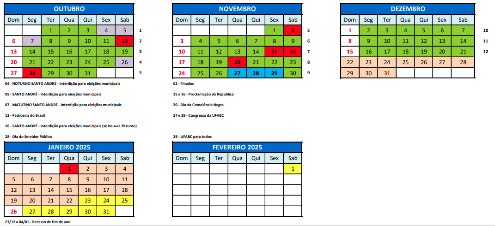

[[Conceitos](https://docs.google.com/spreadsheets/d/1QAVR4EjjFIO7OenRul386hYV4qj17wcFzcPUK7BVRRs/edit?usp=sharing)]

Exame 30 janeiro (repõe 15/11, sexta) das 08:00 às 10:00 na  A-108

# Lógica Básica 2024 - 3

**Professor** [Jair Donadelli](http://hostel.ufabc.edu.br/~jair.donadelli)   ---  **email**  jair.donadelli 'arroba' ufabc. ... — **sala** 546-2 bloco A

------

Esta é uma disciplina de natureza introdutória e que não exige qualquer conhecimento prévio no estudo de lógica,  porém,  requer alguma experiência e maturidade matemática.  Nela, o estudante tem a possibilidade de experimentar o senso de *rigor conceitual* e de *abstração formal*. O conteúdo expõe alguns aspectos da interrelação entre temas de lógica, matemática e computabilidade. Não são abordados aspectos filosóficos da Lógica. 

Se está matriculado, atente para seu email institucional, as comunicações são feitas via siga. 

**Tuma** DA1NHI2049-13SA  **Horário** terças das 10:00 às 12:00; sextas das 08:00 às 10:00. **Local** A-108

**Atendimento** sexta a partir das 10:05 ou em horário combinado previamente.

------

**ÍNDICE**

[toc]

------

### **Programação** 

| Semana     | Tema                           | Subtemas                                                     | Atividades |
| :--------: | ------------------------------ | ------------------------------------------------------------ | ------------------------------------------------------------ |
|   01   | Apresentação e sintaxe da linguagem da lógica proposicional | Uma visão geral de linguagem, metalinguagem, sistemas lógicos.  Definição indutiva de conjuntos.  Alfabeto e fórmulas. Recursos metalinguisticos para simplificação, abreviaturas e omissão de parênteses. | - [leitura](semana1.pdf) - [exercícios](lista1.pdf)  |
|   02   | Sistema dedutivo axiomático do tipo de Hilbert para a lógica proposicional. | Axiomas e regra de inferência. Prova, dedução. Regras derivadas. Propriedades da Dedução | - [leitura](semana2.pdf) - [exercícios](lista2.pdf)  |
|   03   | Semântica da linguagem da lógica proposicional | Valoração e interpretação.  Consequência semântica. | - [leitura](semana3.pdf) - [exercícios](lista3.pdf)  |
|   04   | Semântica da linguagem da lógica proposicional Metateoremas da lógica proposicional | Equivalência semântica. Argumentos válidos. Correção do sistema proposicional. | - [leitura](semana4-5.pdf) - [exercícios](lista4.pdf)  |
|   05   | **Prova 1 na aula da sexta**                                | Consistência e completude do sistema proposicional. conteúdo da P1 é até Argumentos válidos |  |
|   06   | Metateoremas da Lógica de Proposições | Consistência e completude do sistema proposicional.  Sintaxe da lógica de predicados. | o material dessa semana está dividido entre as semanas anterior e a próxima. |
|   07   | Lógica de Predicados, linguagem genérica de 1ª ordem | Sintaxe da lógica de predicados. | - [leitura](semana6-7.pdf) - [exercícios](lista5.pdf)  |
|   08   | Lógica de Predicados | Sistema dedutivo axiomático do tipo de Hilbert.              | - [leitura](semana8.pdf) - [exercícios](lista6.pdf)  |
|   09   | Lógica de Predicados | Teoria formal de primeira ordem. Semântica tarskiana. | - leitura: [3ª](semana9-1.pdf) , [6ª](semana9-2.pdf)  |
|   10   | Lógica de Predicados | Semântica: satisfazibilidade,  consequência lógica. | - [leitura](semana10.pdf) - [exercícios](lista7.pdf)  |
|   11   | **Prova 2 na aula da sexta** |  |  |
|   12   | **Prova sub (terça) e Exame de recuperação (sexta)** |  |  |

### **Ementa**

Cálculo sentencial (ou proposicional) clássico: noções de linguagem, conectivos, dedução e teorema, semântica de valorações. Cálculo clássico de Proposições de primeira ordem: os conceitos de linguagem de primeira ordem, igualdade, teorema da dedução, conseqüência sintática. Semântica: noções de interpretação, verdade em uma estrutura, modelo. O conceito formal de teoria, fecho dedutivo. Exposição informal de temas, e.g.; acerca da consistência de teorias, completude de teorias.

### **Objetivos** 

Introdução a alguns conceitos e teoremas da lógica clássica de primeira-ordem e, também, exposição de seus significados e usos, e.g., na atividade conceitual em matemática e computação.  Explicitam-se as concepções de prova lógica, de caracterização abstrato-formal de relação e objeto, de rigor, de abstração e de linguagem. 

Pretende-se estabelecer certa familiaridade com a noção de sistema lógico e, então, com uma teoria de inferência dedutiva, indicar os contornos de certos pressupostos próprios do método dedutivo, também, a utilização da noção de verdade e métodos de semântica abstrato-formal.

### **Referências bibliográficas**

 [Notas de aula](http://bit.ly/2vbGVmlogica) (pdf 134pp, enviem correções e sugestões, ~~o arquivo será atualizado durante a disciplina)~~

#### Básicas

[1] Augusto Franco de Oliveira. *Lógica e aritmética: uma introdução à lógica, matemática e computacional*. Gradiva, 2010. [[511.3 OLIVlo3\]](http://biblioteca.ufabc.edu.br/index.php?codigo_sophia=14049).    

É difícil estabelecer algumas referências bibliográficas para essa disciplina por vários motivos,  mas principalmente porque a notação raramente é comum, o que pode causar muita confusão para um primeiro curso de lógica. Ademais há pouca coisa boa em português no nível que precisamos. O item [1] acima é a alternativa para contornar esses fatos, é um ótimo livro para começar a estudar lógica, porém não está disponível eletronicamente nem há muitas cópias na biblioteca. Outras alternativas, um pouco menos aderentes à ementa mas ainda assim relevante, são

[2] Rogério Augusto Dos Santos FAJARDO, *Lógica Matemática*. Edusp (2017). 

[3] Raymond M. SMULLYAN. *Lógica de primeira ordem*. São Paulo: UNESP/ Discurso Editorial, 2009

#### Complementares

Para quem quem se sente a vontade lendo em inglês recomendo, na ordem:

[4] Stefan BILANIUK, *A Problem Course in Mathematical Logic* ([pdf](http://euclid.trentu.ca/math/sb/pcml/pcml-16.pdf)) 

[5] Wolfgang RAUTENBERG, *A Concise Introduction to Mathematical Logic*. [Livro digital](http://link.springer.com/book/10.1007%2F978-1-4419-1221-3) (exige IP da UFABC) 

[6] Moedechai BEN-ARI, *Mathematical Logic for Computer Science* [Livro digital](http://link.springer.com/book/10.1007%2F978-1-4471-4129-7) (exige IP da UFABC)

Uma última sugestão de livro, que seria o primeiro da lista porém não está disponível eletronicamente e não tem muitos exemplares, é 

[7] Richard E. Hodel, *An introduction to mathematical logic* [[HODEin 511.3](http://biblioteca.ufabc.edu.br/index.php?codigo_sophia=48830 
)].

------

### **Avaliação e Frequência**

2 provas

É esperado uma conduta ética por parte do aluno. [Aqui](http://professor.ufabc.edu.br/~e.francesquini/codigodehonra/) e [aqui](https://www.ime.usp.br/~coelho/mac0323-2018/plagio.html) se tem uma boa referência do que é esperado. 

Os critérios de avaliação incluem

1.  Apresentação clara, discursiva e objetiva.
2.  Construção correta e em ordem dos argumentos.
3.  Atendimento às normas de correção ortográfica e gramatical.
4.  Observância às orientações específicas da atividade e aos prazos de entrega. 

**Conceito final das provas**: nas avaliações serão atribuídos concentos cujo resultado ao final será de acordo com a seguinte tabela

| P1        |       | A     | B     | C     | D     | F     |       | A     | B     | C     | D     | F     |       | A     | B     | C     | D     | F     |       | A     | B     | C     | D     | F     |       | A     | B     | C     | D     | F     |
| --------- | ----- | ----- | ----- | ----- | ----- | ----- | ----- | ----- | ----- | ----- | ----- | ----- | ----- | ----- | ----- | ----- | ----- | ----- | ----- | ----- | ----- | ----- | ----- | ----- | ----- | ----- | ----- | ----- | ----- | ----- |
| **P2**    | **A** |       |       |       |       |       | **B** |       |       |       |       |       | **C** |       |       |       |       |       | **D** |       |       |       |       |       | **F** |       |       |       |       |       |
| **Final** |       | **A** | **A** | **B** | **C** | **D** |       | **A** | **B** | **B** | **C** | **D** |       | **B** | **C** | **C** | **C** | **F** |       | **C** | **D** | **D** | **F** | **F** |       | **D** | **D** | **F** | **F** | **F** |

**Frequência** mínima de 75%.

**Substitutiva**.  O aluno que perder uma prova por razão justificada e de acordo com o [regimento](https://www.ufabc.edu.br/images/consepe/resolucoes/resolucao_227_-_regulamenta_a_aplicacao_de_mecanismos_de_avaliacao_substitutivos_nos_cursos_de_graduacao_da_ufabc_revoga_e_substitui_a_resolucao_consepe_n_181.pdf) da UFABC deve apresentar justificativa e manifestar o interesse em realizar uma prova substitutiva.

**Recuperação**. Engloba todo o conteúdo da disciplina. Só estarão aptos os alunos com frequência mínima. O  aluno *deve manifestar o interesse em realizar o exame após a divulgação da media das provas.*
$$
\text{Resultado} = \max \Big\{\text{Conceito final das provas}, \text{Conceito do exame} \Big\}
$$

### **Links**

  [i] [Plataformas digitais](https://docs.google.com/document/d/1St2GniLrGAuDBJgnb1oFfAlJiLwAJPucC3t0c_Vbza4/edit), Biblioteca UFABC

 [ii] [Como ler e estudar matemática?](http://www.ime.usp.br/~bianconi/recursos/mat.pdf),Ricardo Bianconi

[iii] Material de outras ofertas: [Slides](https://drive.google.com/drive/folders/1qUMZg_yBvaUU64Cag758HYNtarJ_zsRH?usp=sharing), [Provas](https://drive.google.com/drive/folders/1-sce-l0vELbg61WMJTqYFL1T73huhu7s?usp=sharing), [Listas](https://drive.google.com/drive/folders/1I05h-VUIU_QaqVe-xGJOIZWe-mSllfIK?usp=sharing)

